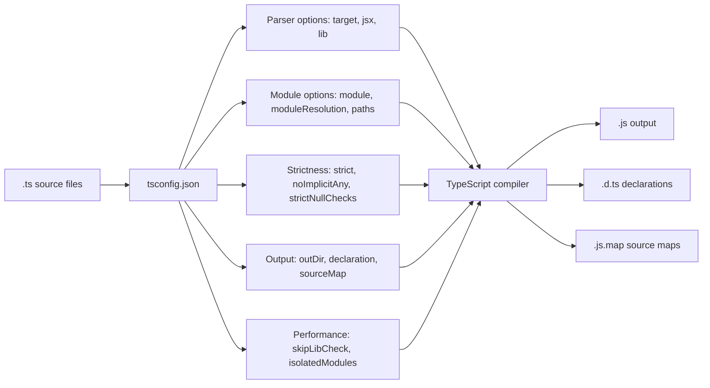
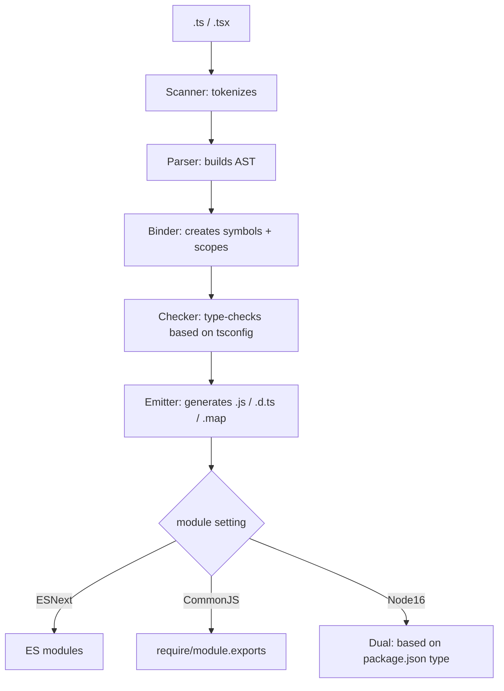
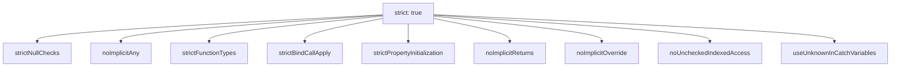
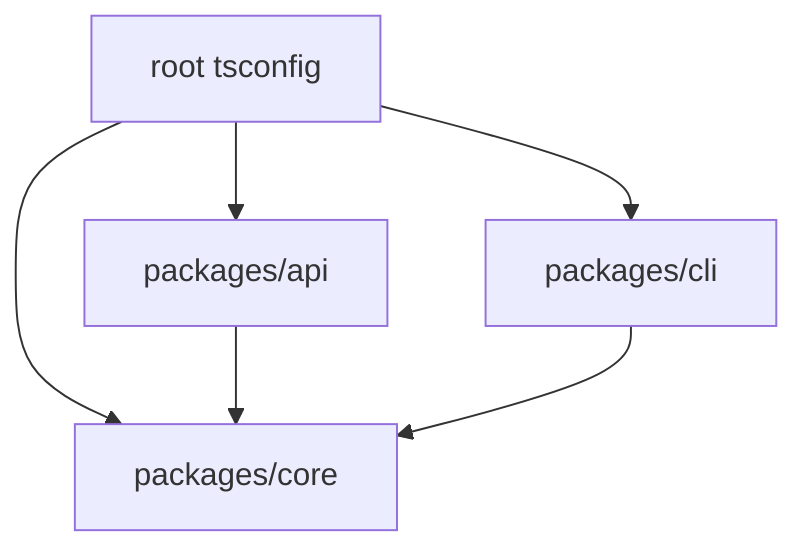

# TypeScript Config and Compiler

> [!summary] Goal
> Understand every major `tsconfig.json` option: what `strict` really enables, how `moduleResolution` affects imports, and how to configure TS for apps, libraries, and monorepos.

## Table of Contents

1. [Why tsconfig Matters](#why-tsconfig-matters)
2. [Compilation Pipeline](#compilation-pipeline)
3. [`strict` Mode Breakdown](#strict-mode-breakdown)
4. [`target` / `module` / `moduleResolution`](#target-module-moduleresolution)
5. [`paths`, `rootDir`, `outDir`](#paths-rootdir-outdir)
6. [Declaration and Build Output](#declaration-and-build-output)
7. [Performance Flags](#performance-flags)
8. [Project References](#project-references)
9. [Sample Configs](#sample-configs)
10. [Pitfalls](#pitfalls)

---

## Why tsconfig Matters

Every TypeScript project starts here. The `tsconfig.json` controls:



> [!tip] Definition
> **`tsconfig.json`**: the configuration file that tells the TypeScript compiler how to parse, check, and emit JavaScript. Every `tsc` invocation reads this file by default.

---

## Compilation Pipeline



---

## `strict` Mode Breakdown

Enabling `strict: true` in tsconfig enables ALL of these individual flags:

| Flag | What it does | Example error it catches |
|------|-------------|-------------------------|
| `strictNullChecks` | `null`/`undefined` are not assignable to other types | `Cannot read properties of null` |
| `noImplicitAny` | Error when TS cannot infer a type and defaults to `any` | `Parameter 'x' implicitly has 'any' type` |
| `strictFunctionTypes` | Proper contravariance for function parameters | `Type 'string \| number' is not assignable to type 'string'` |
| `strictBindCallApply` | `bind`/`call`/`apply` are type-checked | `Argument of type 'number' is not assignable to parameter of type 'string'` |
| `strictPropertyInitialization` | Class properties must be initialized or have `!:` | `Property 'name' has no initializer` |
| `noImplicitReturns` | All code paths must return a value | `Not all code paths return a value` |
| `noImplicitOverride` | Overriding methods must use `override` keyword | `This member must have an 'override' modifier` |
| `noUncheckedIndexedAccess` | Accessing an index signature adds `\| undefined` | `Type 'string \| undefined' is not assignable` |
| `useUnknownInCatchVariables` | `catch(e)` is `unknown`, not `any` | `Object is of type 'unknown'` |

```json
{
  "compilerOptions": {
    "strict": true
    // Equivalent to enabling all flags above
  }
}
```



---

## `target` / `module` / `moduleResolution`

### `target` — what JS version to emit

```json
{
  "compilerOptions": {
    "target": "ES2022"
  }
}
```

| Target | Features compiled away | Use when |
|--------|----------------------|----------|
| `ES5` | Arrow functions, `const/let`, classes | Need IE11 support (legacy) |
| `ES2015` (ES6) | Most ES6 features | Node 12+ |
| `ES2020` | Optional chaining, nullish coalescing | Node 14+ |
| `ES2022` | Class fields, `at()`, `cause` | Node 18+, modern browsers |
| `ESNext` | Latest proposals | Libraries, bleeding edge |

### `module` — module output format

```json
{
  "compilerOptions": {
    "module": "Node16"
  }
}
```

| Module | Output | Resolution used |
|--------|--------|-----------------|
| `CommonJS` | `require()` / `exports` | Classic or Node |
| `ESNext` | `import` / `export` | Classic or Bundler |
| `Node16` | `import`/`require` based on package.json `type` | Node16 (respects `type`) |
| `NodeNext` | Like Node16 but future-proof | NodeNext |
| `Preserve` | Keep imports as-is for bundler | Bundler |

### `moduleResolution` — how TS finds imports

```mermaid
flowchart TD
    A["import { X } from './lib'"] --> B{moduleResolution}
    B -->|"classic (legacy)"| C[Looks for ./lib.ts, ./lib.d.ts]
    B -->|"node"| D[Node.js algorithm: ./lib.ts, ./lib/index.ts, node_modules]
    B -->|"node16"| E[package.json exports field + type field]
    B -->|"nodenext"| F[Node16 + future improvements]
    B -->|"bundler"| G[Like node but more permissive (no extension checks)]
```

### Recommended combinations

| Environment | `target` | `module` | `moduleResolution` |
|-------------|----------|----------|-------------------|
| Node 18+ library | `ES2022` | `Node16` | `Node16` |
| Node 18+ app | `ES2022` | `CommonJS` | `Node` |
| React app (Vite) | `ES2020` | `ESNext` | `Bundler` |
| Library (dual CJS/ESM) | `ES2022` | `Node16` | `Node16` |

---

## `paths`, `rootDir`, `outDir`

### Path aliases

```json
{
  "compilerOptions": {
    "baseUrl": ".",
    "paths": {
      "@app/*": ["src/*"],
      "@shared/*": ["../shared/src/*"]
    }
  }
}
```

```ts
// Instead of: import { User } from '../../../models/user'
import { User } from '@app/models/user';
```

> [!warning] Path aliases are compile-time only. Runtime bundler (Vite/Webpack) must also be configured.

### `rootDir` and `outDir`

```json
{
  "compilerOptions": {
    "rootDir": "src",
    "outDir": "dist"
  }
}
```

```
project/
├── src/          ← rootDir
│   └── index.ts
├── dist/         ← outDir (mirrors src/ structure)
│   └── index.js
└── tsconfig.json
```

---

## Declaration and Build Output

```json
{
  "compilerOptions": {
    "declaration": true,         // emit .d.ts files
    "declarationMap": true,      // source maps for .d.ts
    "sourceMap": true,           // .js.map for debugging
    "outDir": "dist"
  }
}
```

| Option | Purpose |
|--------|---------|
| `declaration: true` | Generates `.d.ts` so other TS projects can consume your library |
| `declarationMap: true` | Lets users "go to definition" into your source |
| `sourceMap: true` | Debug `.ts` directly in browser/Node debugger |
| `removeComments: true` | Strips comments from emitted JS |

---

## Performance Flags

```json
{
  "compilerOptions": {
    "skipLibCheck": true,
    "isolatedModules": true,
    "incremental": true,
    "tsBuildInfoFile": ".tsbuildinfo"
  }
}
```

| Flag | What it does | When to use |
|------|-------------|-------------|
| `skipLibCheck: true` | Skips type-checking `.d.ts` files | **Always** — saves massive time, rarely catches bugs |
| `isolatedModules: true` | Each file is treated as a separate module | Required for transpilers (esbuild, Babel) |
| `incremental: true` | Caches compilation info for faster rebuilds | Development |
| `composite: true` | Enables project references + incremental | Monorepos |
| `noEmit: true` | Type-check only, no JS output | CI/validation |

---

## Project References

For monorepos: each package is a project with its own `tsconfig.json`, and the root references them.

```json
// root/tsconfig.json
{
  "compilerOptions": {
    "composite": true,
    "declaration": true
  },
  "references": [
    { "path": "./packages/core" },
    { "path": "./packages/api" },
    { "path": "./packages/cli" }
  ]
}
```



Build order: `tsc --build` compiles dependencies first, then dependents.

---

## Sample Configs

### Node library (ESM-first)

```json
{
  "compilerOptions": {
    "target": "ES2022",
    "module": "Node16",
    "moduleResolution": "Node16",
    "strict": true,
    "declaration": true,
    "declarationMap": true,
    "sourceMap": true,
    "outDir": "dist",
    "rootDir": "src",
    "skipLibCheck": true
  },
  "include": ["src"]
}
```

### React app (Vite)

```json
{
  "compilerOptions": {
    "target": "ES2020",
    "module": "ESNext",
    "moduleResolution": "Bundler",
    "strict": true,
    "jsx": "react-jsx",
    "noEmit": true,
    "isolatedModules": true,
    "esModuleInterop": true,
    "skipLibCheck": true,
    "baseUrl": ".",
    "paths": { "@/*": ["src/*"] }
  },
  "include": ["src"]
}
```

### Monorepo package

```json
{
  "compilerOptions": {
    "target": "ES2022",
    "module": "Node16",
    "moduleResolution": "Node16",
    "strict": true,
    "composite": true,
    "declaration": true,
    "declarationMap": true,
    "outDir": "dist",
    "rootDir": "src",
    "skipLibCheck": true
  },
  "include": ["src"],
  "references": []
}
```

---

## Pitfalls

### `paths` without runtime config

Path aliases in `tsconfig` only affect type-checking. The emitted JS still has unresolved `@app/...` imports.

**Fix**: Configure your bundler (Vite `resolve.alias`, Webpack `resolve.alias`) or use `tsc-alias` post-build.

### `moduleResolution` mismatch

```json
{
  "module": "ESNext",
  "moduleResolution": "node"  // mixed — TS 5+ gives warning
}
```

**Fix**: match `moduleResolution` to `module`: `Node16` for `Node16`, `Bundler` for `ESNext`.

### Forgetting `esModuleInterop`

Without `esModuleInterop: true`:

```ts
import express from 'express';  // Error: has no default export
```

**Fix**: Enable `esModuleInterop` (or `allowSyntheticDefaultImports`).

### `strict: true` surprises when enabling gradually

Adding strict to an existing project breaks hundreds of files. **Fix**: enable flags one at a time, or use `strict: true` from the start.

---

> [!question]- Interview Questions
>
> **Q: What does `strict: true` enable?**
> A: All 9 strictness flags: `strictNullChecks`, `noImplicitAny`, `strictFunctionTypes`, `strictBindCallApply`, `strictPropertyInitialization`, `noImplicitReturns`, `noImplicitOverride`, `noUncheckedIndexedAccess`, `useUnknownInCatchVariables`.
>
> **Q: What is the difference between `module` and `moduleResolution`?**
> A: `module` controls the output module format (ESM vs CJS). `moduleResolution` controls how TS resolves import paths (Node algorithm, Node16 exports field, Bundler).
>
> **Q: What does `skipLibCheck` do and why use it?**
> A: It skips type-checking of `.d.ts` files. Use it because third-party declaration files rarely benefit from your project's strictness settings, and skipping them dramatically speeds up compilation.
>
> **Q: What are project references used for?**
> A: They enable monorepo-style builds where packages reference each other. `tsc --build` compiles them in dependency order with incremental caching.

---

## Cross-Links

- [[TypeScript/01_Foundations/06_Modules_and_Imports]] for module resolution patterns
- [[TypeScript/04_Playbooks/04_Linting_and_Formatting]] for ESLint integration with tsconfig
- [[TypeScript/04_Playbooks/05_Migrating_JS_to_TS]] for `allowJs`/`checkJs` migration config

---

## References

- [TypeScript tsconfig Reference](https://www.typescriptlang.org/tsconfig/)
- [TypeScript Module Resolution](https://www.typescriptlang.org/docs/handbook/modules/theory.html)
- [Project References](https://www.typescriptlang.org/docs/handbook/project-references.html)
- [TypeScript Strict Mode](https://www.typescriptlang.org/tsconfig/#strict)
