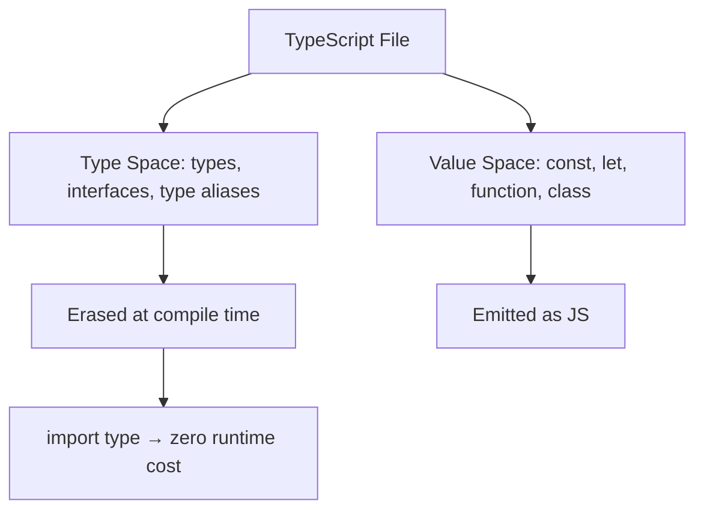
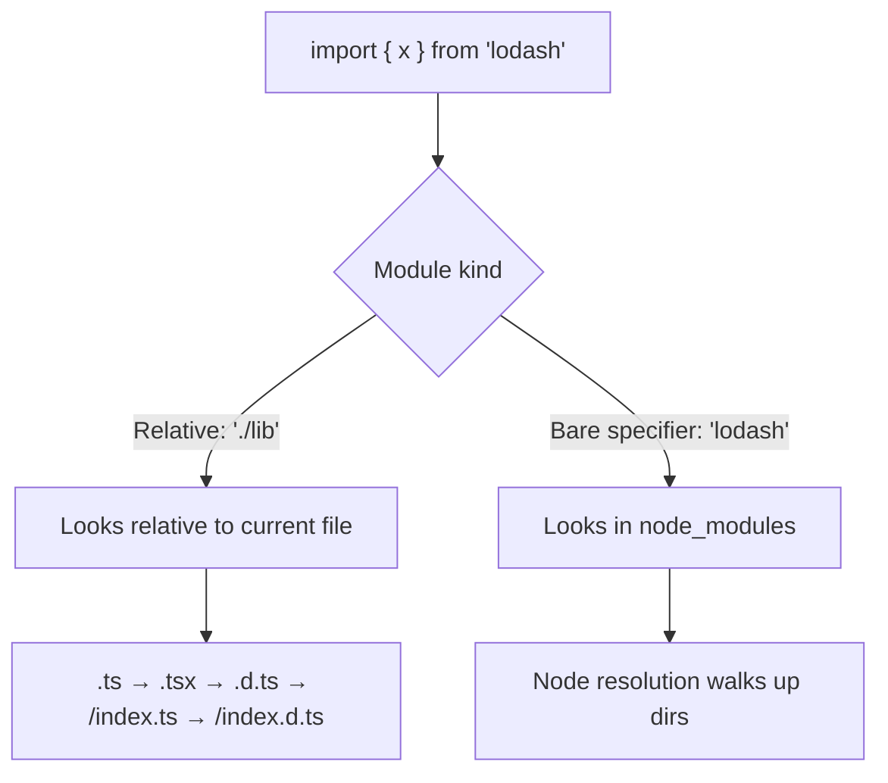

# Modules and Imports

> [!summary] Goal
> Master TypeScript's module system: ES module syntax, type-only imports, module resolution strategies, and how to structure code across files.

## Table of Contents

1. [Why Modules Matter](#why-modules-matter)
2. [ES Module Syntax](#es-module-syntax)
3. [Type-Only Imports and Exports](#type-only-imports-and-exports)
4. [Module Resolution Strategies](#module-resolution-strategies)
5. [Ambient Declarations and `declare`](#ambient-declarations-and-declare)
6. [Namespace (Legacy)](#namespace)
7. [Package Exports and Types](#package-exports-and-types)
8. [Pitfalls](#pitfalls)

---

## Why Modules Matter

TypeScript operates in two "spaces": the **type space** (types, interfaces) and the **value space** (variables, functions, classes). Understanding how imports work in each is critical.



> [!tip] Definition
> **Module**: any file with a top-level `import` or `export`. Everything inside a module is scoped to that file unless explicitly exported.

---

## ES Module Syntax

### Named exports and imports

```ts
// helpers.ts
export function formatDate(d: Date): string {
  return d.toISOString().split('T')[0];
}

export const VERSION = '1.0.0';

export interface Config {
  debug: boolean;
}
```

```ts
// app.ts
import { formatDate, VERSION, Config } from './helpers';
```

### Default exports

```ts
// store.ts
export default class Store { /* ... */ }

// app.ts
import Store from './store';
```

### Re-exports

```ts
// index.ts — barrel file
export { formatDate } from './helpers';
export type { Config } from './helpers';
export { default as Store } from './store';
```

### Namespace imports

```ts
import * as Helpers from './helpers';
Helpers.formatDate(new Date());
Helpers.VERSION;
```

---

## Type-Only Imports and Exports

### `import type` — zero runtime cost

```ts
// BAD: imports type AND value, but type is erased
import { Config } from './config';  // Config is a type, still in import

// GOOD: explicitly type-only import
import type { Config } from './config';
// Erased entirely from the emitted JS
```

### `export type`

```ts
export type { User } from './user';
```

### When to use `import type`

| Scenario | Use `import type`? | Why |
|----------|-------------------|-----|
| Importing an `interface` | ✅ Yes | No runtime value needed |
| Importing a `type` alias | ✅ Yes | Erased at compile time |
| Importing a `class` | ❌ No | Class is both type AND value |
| Importing a `const enum` | ❌ No | Needs value for inlining |
| Cyclic dependency (type only) | ✅ Yes | Breaks the cycle |
| Library author | ✅ Yes | Consumers see no runtime dep |

### Transpile-time verification

With `isolatedModules: true`, TS enforces that you don't accidentally mix re-exported types:

```ts
// ERROR: Re-exporting a type with 'export' when 'isolatedModules' is set
export { Config } from './config';
// Fix:
export type { Config } from './config';
```

---

## Module Resolution Strategies



### Resolution by `moduleResolution`

| Strategy | Relative imports | Bare specifiers | Package `exports` |
|----------|----------------|-----------------|-------------------|
| `classic` (legacy) | `./lib.ts` | Ignores `node_modules` structure | No |
| `node` (old Node) | `./lib.ts`, `./lib/index.ts` | Walks `node_modules` up | No |
| `node16` | Requires `.js` extension | Respects `package.json` `exports` | Yes |
| `nodenext` | Like node16 | Like node16 + future | Yes |
| `bundler` | Like node but flexible | Like node | Yes (if enabled) |

### Node16 resolution — the modern standard

```json
{
  "compilerOptions": {
    "module": "Node16",
    "moduleResolution": "Node16"
  }
}
```

With `Node16`, imports must include the **.js extension** (even though the source is `.ts`):

```ts
// Under Node16 resolution:
import { formatDate } from './helpers.js';  // resolves to helpers.ts
import { Config } from './config.js';       // resolves to config.ts
```

This mirrors how Node.js ESM actually works — the extension in the import is what Node sees at runtime.

---

## Ambient Declarations and `declare`

Ambient declarations tell TypeScript about types that exist at runtime without providing an implementation.

### `declare module`

```ts
// globals.d.ts
declare module '*.css' {
  const content: Record<string, string>;
  export default content;
}

declare module '*.svg' {
  const url: string;
  export default url;
}
```

### `declare global`

Augment the global scope from within a module:

```ts
// global-augment.d.ts
export {};

declare global {
  interface Window {
    __APP_CONFIG__: { apiUrl: string };
  }
}

// Now window.__APP_CONFIG__ is typed
```

---

## Namespace (Legacy)

Before ES modules, TypeScript had `namespace` (formerly `module` keyword). You'll encounter it in older codebases and `.d.ts` files:

```ts
namespace MyLib {
  export interface Config { debug: boolean }
  export function init(c: Config) { /* ... */ }
}

// Usage:
MyLib.init({ debug: true });
```

**When to use**: Almost never in new code. Use ES modules. Namespaces only appear in:
- Legacy `.d.ts` files (jQuery, etc.)
- `global` declarations
- Some library API patterns

---

## Package Exports and Types

Modern packages declare their entry points in `package.json`:

```json
{
  "name": "my-lib",
  "type": "module",
  "main": "./dist/index.js",
  "types": "./dist/index.d.ts",
  "exports": {
    ".": {
      "import": "./dist/index.js",
      "require": "./dist/index.cjs",
      "types": "./dist/index.d.ts"
    },
    "./utils": {
      "import": "./dist/utils.js",
      "types": "./dist/utils.d.ts"
    }
  }
}
```

The `types` field is version-specific. For broad compatibility:

```json
{
  "typesVersions": {
    ">=4.2": {
      "*": ["./dist/ts4.2/*"]
    }
  }
}
```

---

## Pitfalls

### Importing a type without `import type`

```ts
import { User } from './user';  // User is a type, but generates a runtime import
```

**Fix**: `import type { User } from './user'` — fully erased at compile time.

### Missing `.js` extension under Node16

```ts
// FAILS under Node16:
import { helper } from './helpers';
// Fix: add .js extension
import { helper } from './helpers.js';
```

### Barrel file cyclic deps

```ts
// index.ts exports everything → can cause cycles
export * from './a';
export * from './b';
```

**Fix**: Use `import type` in barrels, or re-export selectively.

### `export *` and name collisions

```ts
// a.ts: export const log = ...
// b.ts: export const log = ...
// index.ts: export * from './a'; export * from './b';
// Error: 'log' cannot be exported twice
```

**Fix**: Use explicit named re-exports or namespace imports.

---

> [!question]- Interview Questions
>
> **Q: What is the difference between `import type` and regular `import`?**
> A: `import type` imports only the type information and is completely erased from the emitted JavaScript. Regular `import` can bring in both types and runtime values.
>
> **Q: Why does Node16 resolution require `.js` extension in imports?**
> A: Because Node.js ESM actually resolves `.js` extensions at runtime. TypeScript mirrors this behavior so the emitted JS matches the import paths Node expects.
>
> **Q: What is a barrel file and what problems can it cause?**
> A: A barrel file (`index.ts`) re-exports from multiple modules. It can cause circular dependencies, tree-shaking issues, and slower type-checking if overused.
>
> **Q: What are ambient declarations used for?**
> A: They describe the shape of runtime code (global variables, file types, third-party JS libraries) to TypeScript without providing implementations. Written in `.d.ts` files using `declare`.

---

## Cross-Links

- [[TypeScript/01_Foundations/05_TS_Config_and_Compiler]] for moduleResolution and target settings
- [[TypeScript/02_Core/07_Declaration_Files_and_AtTypes]] for `.d.ts` file patterns
- [[TypeScript/04_Playbooks/05_Migrating_JS_to_TS]] for adding `@types` during migration

---

## References

- [TypeScript Modules](https://www.typescriptlang.org/docs/handbook/2/modules.html)
- [TypeScript Module Resolution](https://www.typescriptlang.org/docs/handbook/modules/theory.html)
- [TypeScript `import type`](https://www.typescriptlang.org/docs/handbook/release-notes/typescript-3-8.html#type-only-imports-and-export)
- [Node.js Package Exports](https://nodejs.org/api/packages.html#package-entry-points)
