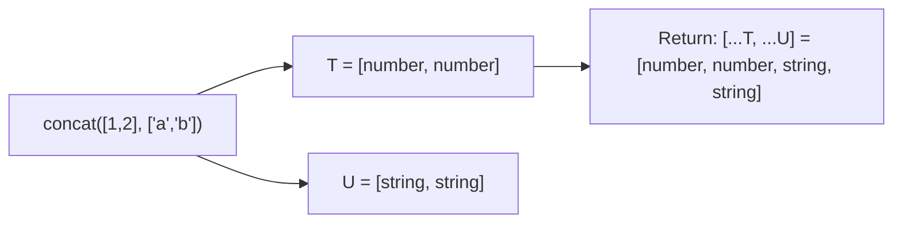

# Advanced Generics

> [!summary] Goal
> Use `keyof`, indexed access types, variadic tuples, and advanced constraint patterns to build type-safe, flexible APIs.

## Table of Contents

1. [Why Advanced Generics](#why-advanced-generics)
2. [`keyof` and Indexed Access Types](#keyof-and-indexed-access-types)
3. [Conditional Generic Helpers](#conditional-generic-helpers)
4. [Variadic Tuple Types](#variadic-tuple-types)
5. [Generic Inference Patterns](#generic-inference-patterns)
6. [Pitfalls](#pitfalls)

---

## Why Advanced Generics

Beyond basic `T extends ...`, TypeScript's generic capabilities let you build types that adapt to their inputs.

---

## `keyof` and Indexed Access Types

### `keyof T` — union of keys

```ts
interface User { id: string; email: string; name: string; age: number; }

type UserKeys = keyof User;
// 'id' | 'email' | 'name' | 'age'
```

### Indexed access — `T[K]`

```ts
type UserNameType = User['name'];   // string
type UserIdType = User['id'];       // string
type UserValueTypes = User[keyof User];  // string | number
```

### Generic property getter

```ts
function getProperty<T, K extends keyof T>(obj: T, key: K): T[K] {
  return obj[key];
}

const user: User = { id: '1', email: 'a@b.com', name: 'Alice', age: 30 };

const name = getProperty(user, 'name');  // string
const age = getProperty(user, 'age');    // number
// getProperty(user, 'xxx');              // Error: 'xxx' not in keyof
```

### Mapping keys to values

```ts
type ValueOf<T> = T[keyof T];
type UserValue = ValueOf<User>;  // string | number
```

---

## Conditional Generic Helpers

### Extract keys of a certain type

```ts
type KeysOfType<T, V> = {
  [K in keyof T]: T[K] extends V ? K : never;
}[keyof T];

type StringKeys = KeysOfType<User, string>;
// 'id' | 'email' | 'name'

// Implementation: map each key to either the key or never, then index
```

### Pick by value type

```ts
type PickByType<T, V> = {
  [K in KeysOfType<T, V>]: T[K];
};

type UserStrings = PickByType<User, string>;
// { id: string; email: string; name: string }
```

### Optional keys

```ts
type OptionalKeys<T> = {
  [K in keyof T]-?: {} extends Pick<T, K> ? K : never;
}[keyof T];

interface Config { host: string; port?: number; debug?: boolean; }
type Optional = OptionalKeys<Config>;  // 'port' | 'debug'
```

---

## Variadic Tuple Types

Variadic tuple types let you capture and transform tuple structures:

```ts
// Generic function that preserves tuple types
function concat<T extends unknown[], U extends unknown[]>(
  a: [...T],
  b: [...U]
): [...T, ...U] {
  return [...a, ...b];
}

const result = concat([1, 2], ['a', 'b']);
// const result: [number, number, string, string]
```



### Variadic tuple with generics

```ts
type Head<T extends unknown[]> = T extends [infer First, ...unknown[]] ? First : never;
type Tail<T extends unknown[]> = T extends [unknown, ...infer Rest] ? Rest : [];

type H = Head<[string, number, boolean]>;  // string
type T = Tail<[string, number, boolean]>;  // [number, boolean]
```

### Typing variadic function parameters

```ts
function zip<T extends unknown[][]>(
  ...arrays: { [K in keyof T]: T[K] extends unknown[] ? T[K] : never }
): { [K in keyof T]: T[K] extends (infer U)[] ? U : never }[] {
  const minLength = Math.min(...arrays.map(a => a.length));
  return Array.from({ length: minLength }, (_, i) =>
    arrays.map(a => a[i]) as any
  );
}

const zipped = zip([1, 2], ['a', 'b'], [true, false]);
// type: [{ id: number }, { name: string }, { active: boolean }][]
```

### Typing `Promise.all` like the standard library

```ts
// Simplified version of how TS types Promise.all:
type PromiseAll<T extends readonly unknown[]> = {
  -readonly [K in keyof T]: Awaited<T[K] extends Promise<infer U> ? U : T[K]>;
};
```

---

## Generic Inference Patterns

### Inference from function parameters

```ts
// Good: T is inferred from the argument
function wrapInArray<T>(value: T): T[] {
  return [value];
}

// Bad: T must be explicit — no inference source
function createInstance<T>(): T {
  return {} as T;
}
```

### Inference from complex parameters

```ts
function groupBy<T, K extends string | number | symbol>(
  items: T[],
  keyFn: (item: T) => K
): Record<K, T[]> {
  const result = {} as Record<K, T[]>;
  for (const item of items) {
    const key = keyFn(item);
    (result[key] ??= []).push(item);
  }
  return result;
}

const grouped = groupBy([1, 2, 3, 4], n => n > 2 ? 'big' : 'small');
// grouped: Record<'big' | 'small', number[]>
```

### Inference with `this` parameter

```ts
type EventMap = { click: MouseEvent; keydown: KeyboardEvent };

class Emitter<T extends Record<string, unknown>> {
  on<K extends keyof T>(event: K, handler: (data: T[K]) => void): this {
    return this;
  }
}

const emitter = new Emitter<EventMap>();
emitter.on('click', e => console.log(e.clientX));  // e is MouseEvent
```

---

## Pitfalls

### Inferring too wide types

```ts
function identity<T>(x: T): T { return x; }

// T inferred as 'hello' | 42 — not string | number
const result = identity(Math.random() > 0.5 ? 'hello' : 42);
```

**Fix**: Use explicit type annotation when inference is too wide: `identity<string | number>(...)`.

### Overloaded functions with inconsistent generics

```ts
function process<T>(x: T): T;
function process<T>(x: T[]): T[];
function process(x: any): any {
  return Array.isArray(x) ? x.map((v: any) => v) : x;
}
```

**Fix**: Use variadic tuple types or conditional types instead of overloads when possible.

### Generic constraints accidentally widening

```ts
// BAD: T extends string widens to string
function firstChar<T extends string>(x: T): T extends `${infer F}${string}` ? F : never {
  return x[0] as any;
}

const c = firstChar('hello');  // string, not 'h'
```

**Fix**: Use `const` type parameters (TS 5.0+): `function firstChar<const T extends string>(x: T): ...`.

---

> [!question]- Interview Questions
>
> **Q: What does `keyof T` return?**
> A: A union of all property keys of type T. For `{ a: string; b: number }`, `keyof T` is `'a' | 'b'`.
>
> **Q: How do variadic tuple types work?**
> A: They use spread syntax in tuple positions (`[...T]`, `[first, ...rest]`, `[...T, ...U]`) to capture and transform tuple structures generically.
>
> **Q: What is `T[K]` in TypeScript?**
> A: An indexed access type. If `T` is an object type and `K` is a key, `T[K]` is the type of that property. Used with `keyof T` for dynamic property access patterns.
>
> **Q: What is a `KeysOfType<T, V>` helper?**
> A: A custom utility type that returns the keys of `T` whose values are of type `V`. Built from mapped types and indexed access.

---

## Cross-Links

- [[TypeScript/01_Foundations/03_Generics_Basics]] for generic fundamentals
- [[TypeScript/03_Advanced/01_Conditional_Types]] for conditional helper implementations
- [[TypeScript/02_Core/09_Utility_Types_Deep_Dive]] for custom utility construction

---

## References

- [TypeScript keyof](https://www.typescriptlang.org/docs/handbook/2/keyof-types.html)
- [Indexed Access Types](https://www.typescriptlang.org/docs/handbook/2/indexed-access-types.html)
- [Variadic Tuple Types](https://www.typescriptlang.org/docs/handbook/release-notes/typescript-4-0.html#variadic-tuple-types)
- [Template Literal Types](https://www.typescriptlang.org/docs/handbook/2/template-literal-types.html)
