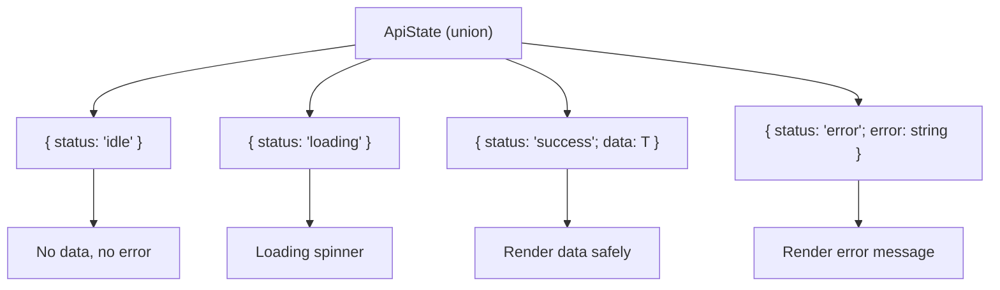

# Discriminated Unions

> [!summary] Goal
> Model state machines and complex domain data with discriminated unions — compile-time exhaustiveness checking, multi-level discriminants, and pattern matching.

## Table of Contents

1. [Why Discriminated Unions](#why-discriminated-unions)
2. [Basic Discriminated Union](#basic-discriminated-union)
3. [Exhaustiveness Checking](#exhaustiveness-checking)
4. [Multi-Level Discriminants](#multi-level-discriminants)
5. [State Machines with Discriminated Unions](#state-machines-with-discriminated-unions)
6. [Async Result Pattern](#async-result-pattern)
7. [Pitfalls](#pitfalls)

---

## Why Discriminated Unions

Discriminated unions model "this or that but not both" states with compile-time safety:



---

## Basic Discriminated Union

```ts
type Shape =
  | { kind: 'circle'; radius: number }
  | { kind: 'rectangle'; width: number; height: number }
  | { kind: 'triangle'; base: number; height: number };

function area(shape: Shape): number {
  switch (shape.kind) {
    case 'circle':
      return Math.PI * shape.radius ** 2;
    case 'rectangle':
      return shape.width * shape.height;
    case 'triangle':
      return (shape.base * shape.height) / 2;
  }
}
```

### Non-switch narrowing

```ts
function describe(shape: Shape): string {
  if (shape.kind === 'circle') {
    return `Circle with radius ${shape.radius}`;
  }
  if (shape.kind === 'rectangle') {
    return `Rectangle ${shape.width}x${shape.height}`;
  }
  return `Triangle ${shape.base}x${shape.height}`;
}
```

---

## Exhaustiveness Checking

The `never` type ensures all union members are handled:

```ts
function assertNever(value: never): never {
  throw new Error(`Unhandled case: ${value}`);
}

function getArea(shape: Shape): number {
  switch (shape.kind) {
    case 'circle': return Math.PI * shape.radius ** 2;
    case 'rectangle': return shape.width * shape.height;
    case 'triangle': return (shape.base * shape.height) / 2;
    default: return assertNever(shape);
    // If a new shape is added, this line errors at compile time
  }
}
```

### Adding a new variant

```ts
type Shape =
  | { kind: 'circle'; radius: number }
  | { kind: 'rectangle'; width: number; height: number }
  | { kind: 'triangle'; base: number; height: number }
  | { kind: 'pentagon'; side: number };  // NEW

// getArea now errors — 'pentagon' not handled in default branch
```

---

## Multi-Level Discriminants

```ts
type Event =
  | { type: 'user'; action: 'created'; userId: string; email: string }
  | { type: 'user'; action: 'deleted'; userId: string }
  | { type: 'user'; action: 'updated'; userId: string; changes: string[] }
  | { type: 'system'; severity: 'info' | 'error'; message: string }
  | { type: 'system'; severity: 'critical'; message: string; alert: boolean };

function handleEvent(event: Event): void {
  switch (event.type) {
    case 'user':
      switch (event.action) {
        case 'created':
          console.log(`Created user ${event.userId} with email ${event.email}`);
          break;
        case 'deleted':
          console.log(`Deleted user ${event.userId}`);
          break;
        case 'updated':
          console.log(`Updated user ${event.userId}: ${event.changes.join(', ')}`);
          break;
      }
      break;
    case 'system':
      // event.severity: 'info' | 'error' | 'critical'
      if (event.severity === 'critical') {
        console.error(`ALERT: ${event.message}`);
      } else {
        console.log(`[${event.severity}] ${event.message}`);
      }
      break;
  }
}
```

---

## State Machines with Discriminated Unions

```ts
// UI state for a data-fetching component
type LoadingState<T> =
  | { status: 'idle' }
  | { status: 'loading' }
  | { status: 'success'; data: T; timestamp: number }
  | { status: 'error'; error: string; retryCount: number };

class StateMachine<T> {
  private state: LoadingState<T> = { status: 'idle' };

  start(): void {
    this.state = { status: 'loading' };
  }

  success(data: T): void {
    this.state = { status: 'success', data, timestamp: Date.now() };
  }

  fail(error: string): void {
    const retryCount = this.state.status === 'error' ? this.state.retryCount + 1 : 1;
    this.state = { status: 'error', error, retryCount };
  }

  getState(): LoadingState<T> {
    return this.state;
  }
}

// Usage with exhaustive render
function renderState<T>(state: LoadingState<T>): string {
  switch (state.status) {
    case 'idle': return 'Press start to load';
    case 'loading': return 'Loading...';
    case 'success': return `Data: ${JSON.stringify(state.data)} (loaded at ${state.timestamp})`;
    case 'error': return `Error: ${state.error} (retry #${state.retryCount})`;
  }
}
```

---

## Async Result Pattern

```ts
type Result<T, E = Error> =
  | { ok: true; data: T }
  | { ok: false; error: E };

async function fetchJson<T>(url: string): Promise<Result<T>> {
  try {
    const res = await fetch(url);
    if (!res.ok) {
      return { ok: false, error: new Error(`HTTP ${res.status}`) };
    }
    return { ok: true, data: await res.json() };
  } catch (err) {
    return { ok: false, error: err instanceof Error ? err : new Error(String(err)) };
  }
}

const result = await fetchJson<User>('/users/123');
if (result.ok) {
  console.log(result.data.name);  // typed: User
} else {
  console.error(result.error.message);  // typed: Error
}
```

---

## Pitfalls

### Missing discriminant property

```ts
type Shape =
  | { kind: 'circle'; radius: number }
  | { kind: 'rectangle'; width: number }  // Missing `height`!
  | { kind: 'triangle'; base: number; height: number };
```

**Fix**: Ensure each variant has all required properties. Use a helper type to enforce discriminant presence.

### Widening discriminant type

```ts
// BAD: discriminant is `string`, not a literal
type Shape = { kind: string; radius?: number; width?: number; height?: number };
// Can't narrow — all properties are optional
```

**Fix**: Each discriminant value must be a **literal** type (`'circle'`, not `string`).

### Arrow function exhaustiveness

```ts
function area(shape: Shape): number {
  // With .map or .forEach, exhaustiveness is per-function, not per-callback
  shapes.map(s => {
    switch (s.kind) { /* ... */ }
    // Default check must be inside the callback
  });
  return 0;
}
```

---

> [!question]- Interview Questions
>
> **Q: What is a discriminated union?**
> A: A union type where each member has a common property (the discriminant) with a literal type, enabling type-safe narrowing based on that property.
>
> **Q: How do you ensure exhaustiveness when adding a new variant?**
> A: Add a `default` case that calls `assertNever(value: never)`. If a new variant is added, TypeScript flags the default case because the value is no longer `never`.
>
> **Q: What is the advantage of discriminated unions over optional properties?**
> A: Discriminated unions enforce that only valid property combinations exist. Optional properties can represent invalid states (e.g., `data` and `error` both set).
>
> **Q: Can you nest discriminant narrowing?**
> A: Yes. For example, narrowing on `event.type` first, then narrowing on `event.action` inside the first branch. Each nesting level tightens the type.

---

## Cross-Links

- [[TypeScript/01_Foundations/04_Narrowing_and_Type_Guards]] for narrowing fundamentals
- [[TypeScript/03_Advanced/04_Typing_Patterns_for_APIs]] for Result type pattern
- [[TypeScript/04_Playbooks/06_TypeScript_with_React]] for component state as discriminated unions

---

## References

- [TypeScript Discriminated Unions](https://www.typescriptlang.org/docs/handbook/2/narrowing.html#discriminated-unions)
- [TypeScript Exhaustive Checks](https://www.typescriptlang.org/docs/handbook/2/narrowing.html#exhaustiveness-checking)
- [Algebraic Data Types](https://www.typescriptlang.org/play/#example/discriminate-types)
