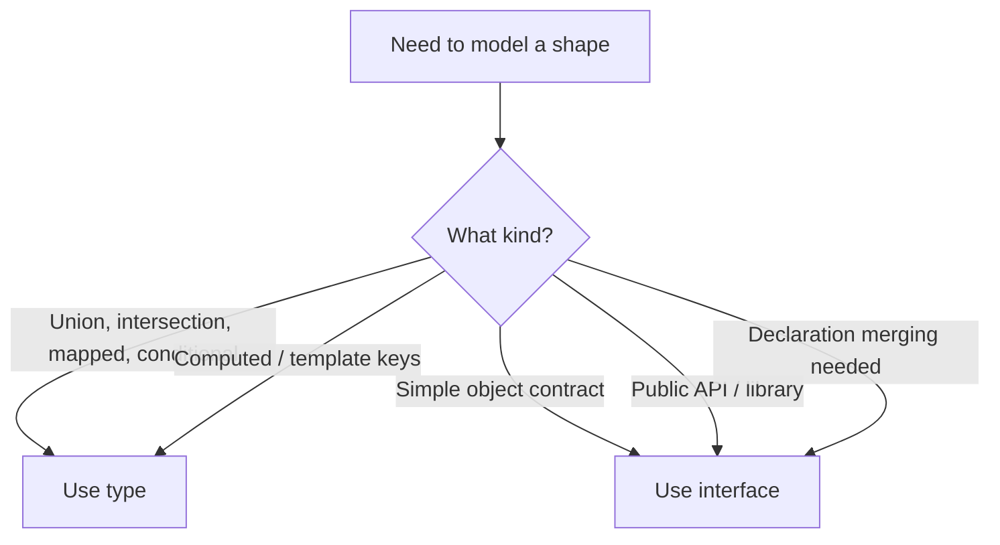
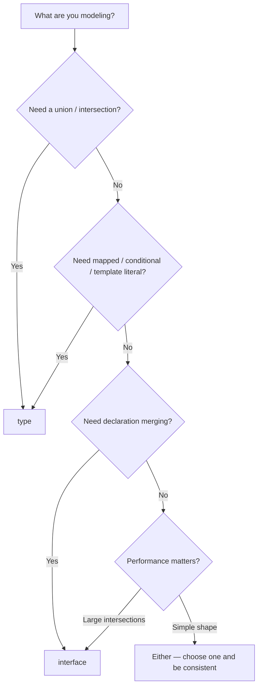

# Types vs Interfaces

> [!summary] Goal
> Choose between `type` and `interface` based on what you're modeling. Understand when each excels, when they overlap, and when one is required.

## Table of Contents

1. [Why the Choice Matters](#why-the-choice-matters)
2. [Where They Overlap](#where-they-overlap)
3. [Where Only `type` Works](#where-only-type-works)
4. [Where Only `interface` Works](#where-only-interface-works)
5. [Declaration Merging](#declaration-merging)
6. [Decision Flowchart](#decision-flowchart)
7. [Pitfalls](#pitfalls)

---

## Why the Choice Matters

`type` and `interface` can often be used interchangeably for object shapes, but they have important differences:



---

## Where They Overlap

For basic object shapes, both work identically:

```ts
// Type alias
type User = {
  id: string;
  email: string;
  name: string;
};

// Interface
interface User {
  id: string;
  email: string;
  name: string;
}

// Both can:
// - Be used as property types
// - Extend other types
// - Implement generics
// - Be used in constraints
```

### Both can extend

```ts
// Type intersection (extends)
type Admin = User & { role: 'admin' };

// Interface extends
interface Admin extends User { role: 'admin'; }
```

### Both can be generic

```ts
type Box<T> = { value: T };
interface Box<T> { value: T; }
```

---

## Where Only `type` Works

### Unions

```ts
type Status = 'idle' | 'loading' | 'success' | 'error';
type Result<T> =
  | { ok: true; data: T }
  | { ok: false; error: string };
```

### Intersection

```ts
type WithTimestamps = { createdAt: Date; updatedAt: Date };
type UserWithTimestamps = User & WithTimestamps;
```

### Mapped types

```ts
type Readonly<T> = { readonly [K in keyof T]: T[K] };
type Optional<T> = { [K in keyof T]?: T[K] };
```

### Conditional types

```ts
type IsString<T> = T extends string ? true : false;
type Unwrap<T> = T extends Promise<infer U> ? U : T;
```

### Template literal types

```ts
type EventName = `on${Capitalize<string>}`;
type Path = `/${string}`;
```

### Computed keys

```ts
type Key = 'name' | 'age';
type Person = { [K in Key]: string };  // type can remap keys

// Interface cannot compute keys this way
```

---

## Where Only `interface` Works

### Declaration merging

Interfaces with the same name are automatically merged:

```ts
interface User { id: string; }
interface User { email: string; }
interface User { name: string; }

// Result: User has id, email, name
```

This is useful for:
- Augmenting global types (`Window`, `Array`)
- Extending types from `@types` packages
- Adding properties to third-party interfaces

### `implements` on classes

```ts
interface Serializable {
  toJSON(): object;
}

class User implements Serializable {
  constructor(public id: string) {}
  toJSON() { return { id: this.id }; }
}
```

---

## Declaration Merging

Only interfaces support declaration merging:

```ts
// Multiple declarations → single merged interface
interface Config { host: string; }
interface Config { port: number; }

const c: Config = { host: 'localhost', port: 3000 };  // OK

// Type aliases CANNOT be merged:
type Config = { host: string; };  // Error: Duplicate identifier
type Config = { port: number; };  // Error: Duplicate identifier
```

### Use case: augmenting library types

```ts
// types/express-augment.d.ts
import 'express';

declare module 'express' {
  interface Request {
    user?: { id: string; role: string };
  }
}

// Now `req.user` is available everywhere
```

---

## Decision Flowchart



### Performance note

For large intersecting types, `interface extends` can be faster than `type &`:

```ts
// interface: faster for large intersections
interface A extends B, C, D {}

// type: may be slower for large intersections
type A = B & C & D;
```

---

## Pitfalls

### `type` alias can't be merged

```ts
type User = { id: string };
// type User = { email: string };  // Error: Duplicate identifier
```

**Fix**: Use `interface` if you need declaration merging.

### Interface can't express computed keys

```ts
type Keys = 'a' | 'b';
// interface Obj { [K in Keys]: string }  // Error: A mapped type may not use a computed literal
type Obj = { [K in Keys]: string };  // OK with type
```

### Interface with `extends` can be less precise

```ts
type Created = { createdAt: Date };
type Updated = { updatedAt: Date };

// type: A & B creates an exact intersection
type Timestamps = Created & Updated;

// interface: Extends both
interface Timestamps extends Created, Updated {}
// Both work, but `type` is more idiomatic for combinations
```

---

> [!question]- Interview Questions
>
> **Q: When should you use `type` vs `interface`?**
> A: Use `type` for unions, intersections, mapped/conditional types, and computed keys. Use `interface` for object shapes that need declaration merging, for `implements`, or for public API contracts.
>
> **Q: Can `interface` express a union type?**
> A: No. Interfaces cannot represent union types. Use `type` for unions.
>
> **Q: What is declaration merging?**
> A: Multiple `interface` declarations with the same name are automatically merged into a single interface with all properties from all declarations. `type` aliases cannot be merged.
>
> **Q: Is there a performance difference between `type` and `interface`?**
> A: For large object types, `interface extends` can be faster than `type &` intersections because interfaces are evaluated lazily. For most cases, the difference is negligible.

---

## Cross-Links

- [[TypeScript/01_Foundations/02_Functions_Objects_and_Interfaces]] for interface basics
- [[TypeScript/03_Advanced/05_Declaration_Merging_and_Augmentation]] for deep merging patterns
- [[TypeScript/02_Core/05_Classes_and_OOP]] for `implements`

---

## References

- [TypeScript Types vs Interfaces](https://www.typescriptlang.org/docs/handbook/2/everyday-types.html#differences-between-type-aliases-and-interfaces)
- [TypeScript Playground: Type vs Interface](https://www.typescriptlang.org/play#example/types-vs-interfaces)
- [Interface Declaration Merging](https://www.typescriptlang.org/docs/handbook/declaration-merging.html)
