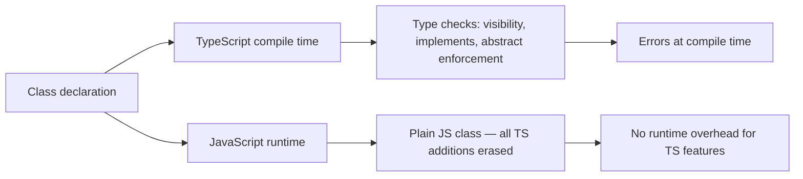

# Classes and OOP

> [!summary] Goal
> Write type-safe classes in TypeScript: understand visibility, abstract classes, parameter properties, and how TS enhances the class pattern beyond plain JavaScript.

## Table of Contents

1. [Why Classes in TypeScript](#why-classes-in-typescript)
2. [Class Syntax and Property Declarations](#class-syntax-and-property-declarations)
3. [Visibility Modifiers](#visibility-modifiers)
4. [Parameter Properties](#parameter-properties)
5. [`readonly` and `static`](#readonly-and-static)
6. [`abstract` Classes](#abstract-classes)
7. [`implements`](#implements)
8. [`get` and `set` Accessors](#get-and-set-accessors)
9. [`this` Parameter](#this-parameter)
10. [Class as Type vs Class as Value](#class-as-type-vs-class-as-value)
11. [Pitfalls](#pitfalls)

---

## Why Classes in TypeScript

TypeScript enhances JavaScript classes with compile-time type checking, visibility modifiers, and parameter properties — all of which are erased at runtime.



> [!tip] Definition
> **Class**: a blueprint for creating objects with shared methods and properties. In TypeScript, a class declaration creates both a **value** (the constructor function at runtime) and a **type** (the instance type).

---

## Class Syntax and Property Declarations

```ts
class User {
  // Property declarations (required in TS)
  id: string;
  email: string;
  createdAt: Date;

  constructor(id: string, email: string) {
    this.id = id;
    this.email = email;
    this.createdAt = new Date();
  }

  displayName(): string {
    return this.email.split('@')[0];
  }
}
```

### Strict property initialization

With `strictPropertyInitialization: true`, every property must be initialized in the constructor or have a default:

```ts
class Config {
  mode: string;                // Error: not initialized
  version: string = '1.0';     // OK: default
  debugMode: boolean;          // OK: initialized in constructor

  constructor(debug: boolean) {
    this.debugMode = debug;
  }
}
```

Use the definite assignment assertion (`!:`) to bypass:

```ts
class LazyInit {
  conn!: DatabaseConnection;   // Promise to initialize before use
  init() { this.conn = new DatabaseConnection(); }
}
```

---

## Visibility Modifiers

| Modifier | Within class | Subclasses | Outside |
|----------|-------------|------------|---------|
| `public` (default) | ✅ | ✅ | ✅ |
| `protected` | ✅ | ✅ | ❌ |
| `private` | ✅ | ❌ | ❌ |

```ts
class Animal {
  public name: string;
  protected sound: string;
  private dna: string;

  constructor(name: string) {
    this.name = name;
    this.sound = '';
    this.dna = 'secret';
  }

  public speak(): void {
    console.log(`${this.name} says ${this.sound}`);
  }
}

class Dog extends Animal {
  constructor() {
    super('Dog');
    this.sound = 'woof';      // OK: protected
    // this.dna = 'xxx';      // Error: private
  }
}

const dog = new Dog();
dog.name;                      // OK: public
// dog.sound;                  // Error: protected
// dog.dna;                    // Error: private
```

### `private` vs JavaScript `#` private

| Feature | TypeScript `private` | JavaScript `#private` |
|---------|---------------------|----------------------|
| Enforced at | Compile time only | Runtime |
| Accessible via | Bypassed with `[]` access | Truly private at runtime |
| Subclass access | No | No |
| Emitted in JS | No | Yes (native private fields) |

**Recommendation**: Use `#` for true runtime privacy, `private` for API contract enforcement.

---

## Parameter Properties

Shorthand to declare and initialize a property in one place:

```ts
class User {
  constructor(
    public id: string,        // declares + initializes this.id
    public email: string,     // declares + initializes this.email
    private role: string,     // declares private this.role
    readonly createdAt: Date = new Date()  // declares readonly
  ) {}
}

// Equivalent to:
class UserLong {
  public id: string;
  public email: string;
  private role: string;
  readonly createdAt: Date;

  constructor(id: string, email: string, role: string, createdAt?: Date) {
    this.id = id;
    this.email = email;
    this.role = role;
    this.createdAt = createdAt ?? new Date();
  }
}
```

---

## `readonly` and `static`

### `readonly`

Properties that can only be assigned once (at declaration or in constructor):

```ts
class Config {
  readonly apiUrl: string;
  readonly maxRetries: number = 3;

  constructor(apiUrl: string) {
    this.apiUrl = apiUrl;      // OK
  }

  update(url: string) {
    // this.apiUrl = url;      // Error: cannot assign to readonly
  }
}
```

### `static`

Properties and methods belong to the class, not instances:

```ts
class MathUtils {
  static PI = 3.14159;

  static circleArea(radius: number): number {
    return MathUtils.PI * radius * radius;
  }
}

MathUtils.PI;                  // OK: static access
MathUtils.circleArea(5);       // OK
// new MathUtils().PI;         // Error: static not on instance
```

### Static type safety

```ts
class Registry {
  private static instances = new Map<string, object>();

  static register(name: string, instance: object): void {
    Registry.instances.set(name, instance);
  }

  static get<T>(name: string): T | undefined {
    return Registry.instances.get(name) as T | undefined;
  }
}
```

---

## `abstract` Classes

Abstract classes cannot be instantiated directly. They define a base with some methods implemented and some left abstract:

```ts
abstract class Shape {
  abstract area(): number;     // must be implemented by subclass

  describe(): string {
    return `Shape with area ${this.area()}`;
  }
}

class Circle extends Shape {
  constructor(private radius: number) { super(); }

  area(): number {
    return Math.PI * this.radius * this.radius;
  }
}

// const s = new Shape();      // Error: cannot instantiate abstract class
const c = new Circle(5);
c.area();                      // 78.54
c.describe();                  // "Shape with area 78.54"
```

### Abstract vs Interface

| Feature | `interface` | `abstract class` |
|---------|-------------|------------------|
| Can have implementation | No | Yes |
| Can have constructor | No | Yes |
| Can have visibility modifiers | No | Yes |
| Multiple inheritance | Yes (multi-implement) | No (single extend) |
| Runtime artifact | No (erased) | Yes (emitted as JS) |

---

## `implements`

A class can declare that it satisfies an interface using `implements`:

```ts
interface Serializable {
  toJSON(): object;
  fromJSON(data: object): this;
}

class User implements Serializable {
  constructor(public id: string, public email: string) {}

  toJSON(): object {
    return { id: this.id, email: this.email };
  }

  fromJSON(data: object): this {
    const d = data as { id: string; email: string };
    this.id = d.id;
    this.email = d.email;
    return this;
  }
}
```

> [!warning] `implements` only checks the type. It does not inherit code. You must implement every member yourself.

---

## `get` and `set` Accessors

```ts
class Temperature {
  private _celsius: number = 0;

  get celsius(): number {
    return this._celsius;
  }

  set celsius(value: number) {
    if (value < -273.15) {
      throw new Error('Below absolute zero');
    }
    this._celsius = value;
  }

  get fahrenheit(): number {
    return this._celsius * 9 / 5 + 32;
  }

  set fahrenheit(value: number) {
    this._celsius = (value - 32) * 5 / 9;
  }
}

const t = new Temperature();
t.celsius = 25;
console.log(t.fahrenheit);    // 77
```

---

## `this` Parameter

TypeScript lets you type the `this` context explicitly:

```ts
type EventContext = { requestId: string };

class Logger {
  log(this: EventContext, message: string): void {
    console.log(`[${this.requestId}] ${message}`);
  }
}

const logger = new Logger();
const ctx = { requestId: 'abc-123' };

// Bind the context:
ctx.log = logger.log;
ctx.log('hello');             // [abc-123] hello

// Without proper context:
// logger.log.call({}, 'x');  // Error: 'requestId' missing in 'this'
```

---

## Class as Type vs Class as Value

A class declaration creates two things:

```ts
class Point {
  constructor(public x: number, public y: number) {}
}

// As a TYPE (the instance shape):
const p: Point = new Point(3, 4);

// As a VALUE (the constructor):
const PointClass: typeof Point = Point;
const p2 = new PointClass(5, 6);
```

| Usage | What you get |
|-------|-------------|
| `: Point` | Instance type `{ x: number; y: number }` |
| `typeof Point` | Constructor type `new (x: number, y: number) => Point` |
| `instanceof Point` | Runtime check (JS `instanceof`) |

---

## Pitfalls

### Forgetting `super()` in subclass

```ts
class Base {
  constructor(public name: string) {}
}

class Derived extends Base {
  constructor() {
    // Error: Must call super() before accessing 'this'
    this.name = 'derived';
  }
}
```

**Fix**: call `super()` before accessing `this`.

### `private` is NOT runtime-safe

```ts
class Secret {
  private password: string = 'secret';
}

const s = new Secret();
(s as any).password;           // bypasses compile-time check — available at runtime
```

**Fix**: Use JavaScript `#` private for true runtime privacy.

### Abstract method not implemented

```ts
abstract class Base {
  abstract run(): void;
}

class Derived extends Base {
  // Error: Non-abstract class 'Derived' does not implement 'run'
}
```

**Fix**: implement all abstract methods.

### Overriding without `override`

With `noImplicitOverride: true`:

```ts
class Base {
  greet() { console.log('hi'); }
}

class Derived extends Base {
  // Error if Base.greet() is removed — 'override' flag prevents silent drift
  override greet() { console.log('hello'); }
}
```

---

> [!question]- Interview Questions
>
> **Q: What is the difference between `public`, `protected`, and `private`?**
> A: `public` (default) accessible everywhere. `protected` accessible in class and subclasses. `private` accessible only within the class. All are compile-time only — JavaScript `#` private provides true runtime privacy.
>
> **Q: What are parameter properties?**
> A: A shorthand where you declare a constructor parameter with a visibility modifier (`public`, `private`, `protected`, `readonly`), which automatically creates and initializes that property on the class.
>
> **Q: What is the difference between `abstract class` and `interface`?**
> A: An abstract class can have implemented methods, constructors, and visibility modifiers. An interface is pure structure with no implementation. A class can `extend` one abstract class but `implement` multiple interfaces.
>
> **Q: How does a class act as both a type and a value?**
> A: The class name represents the instance type when used as a type annotation, and the constructor function when used as a value. `typeof Point` gives the constructor type.

---

## Cross-Links

- [[TypeScript/01_Foundations/02_Functions_Objects_and_Interfaces]] for interface-based object types
- [[TypeScript/02_Core/04_Types_vs_Interfaces]] for when to use classes vs interfaces
- [[TypeScript/03_Advanced/07_Design_Patterns_in_TypeScript]] for class-based design patterns

---

## References

- [TypeScript Classes](https://www.typescriptlang.org/docs/handbook/2/classes.html)
- [TypeScript `private` vs `#`](https://www.typescriptlang.org/docs/handbook/release-notes/typescript-3-8.html#ecmascript-private-fields)
- [Parameter Properties](https://www.typescriptlang.org/docs/handbook/2/classes.html#parameter-properties)
