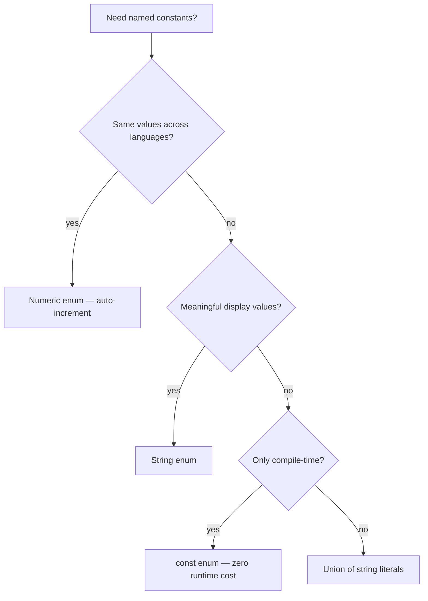
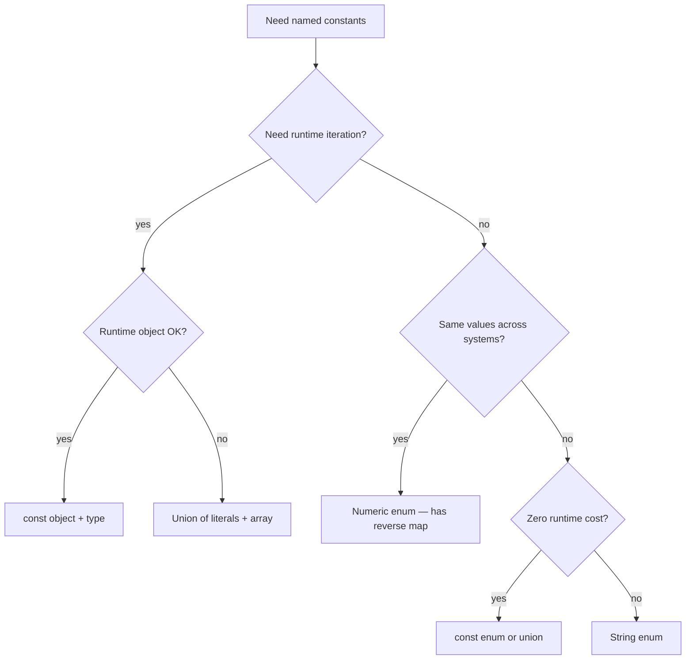

# Enums and Their Alternatives

> [!summary] Goal
> Understand TypeScript enums — numeric, string, const — and when to prefer union types or const objects instead.

## Table of Contents

1. [Why Enums Exist](#why-enums-exist)
2. [Numeric Enums](#numeric-enums)
3. [String Enums](#string-enums)
4. [`const enum`](#const-enum)
5. [Enum Member Types and Reverse Mapping](#enum-member-types-and-reverse-mapping)
6. [Union of Literals as Alternative](#union-of-literals-as-alternative)
7. [Const Object Pattern](#const-object-pattern)
8. [When to Use Each](#when-to-use-each)
9. [Pitfalls](#pitfalls)

---

## Why Enums Exist

Enums group related named constants. TypeScript offers several enum flavors with different runtime behaviors.



---

## Numeric Enums

### Basic numeric enum

```ts
enum Direction {
  Up,      // 0
  Down,    // 1
  Left,    // 2
  Right,   // 3
}
```

### Custom starting value

```ts
enum HttpStatus {
  OK = 200,
  Created = 201,
  BadRequest = 400,
  Unauthorized = 401,
  NotFound = 404,
  InternalServerError = 500,
}
```

### Auto-increment from a start

```ts
enum StatusCode {
  Continue = 100,
  SwitchingProtocols,    // 101
  Processing,            // 102
}
```

### Reverse mapping

Numeric enums emit both `name → value` and `value → name`:

```ts
enum Direction { Up = 1, Down, Left, Right }

Direction.Up;        // 1
Direction[1];        // "Up"
Direction[2];        // "Down"
```

Generated JS:

```js
var Direction;
(function (Direction) {
    Direction[Direction["Up"] = 1] = "Up";
    Direction[Direction["Down"] = 2] = "Down";
})(Direction || (Direction = {}));
```

---

## String Enums

```ts
enum Color {
  Red = '#FF0000',
  Green = '#00FF00',
  Blue = '#0000FF',
}

Color.Red;    // '#FF0000'
Color['Red']; // '#FF0000'
```

### Why string enums

- Meaningful runtime values (compare to numeric `0`/`1`)
- Debuggable in logs
- No reverse mapping (unlike numeric enums)

### Mixed enums (possible but avoid)

```ts
enum Mixed {
  Yes = 1,
  No = 'NO',       // allowed but confusing
}
```

**Recommendation**: Keep enums all-numeric or all-string. Never mix.

---

## `const enum`

`const enum` is **completely inlined** at compile time — zero runtime JavaScript:

```ts
const enum Axis {
  X = 'x',
  Y = 'y',
  Z = 'z',
}

const dir = Axis.X;  // compiled to: const dir = 'x';
```

Generated JS:

```js
const dir = 'x';  // no enum object at all
```

### Requirements

| Feature | Regular enum | `const enum` |
|---------|-------------|--------------|
| Runtime object | Yes | No (inlined) |
| Reverse mapping | Yes (numeric) | No |
| Works with `isolatedModules` | Yes | No (needs `const-enum` plugin) |
| Can use in `.d.ts` | Yes | No |
| Bundle size | Larger | Smaller |

> [!warning] `const enum` may not work with `isolatedModules: true` or bundlers. If you use Vite/esbuild, prefer `const enum` with `preserveConstEnums: true`, or avoid `const enum` entirely.

---

## Enum Member Types and Reverse Mapping

### Enum as literal type

```ts
enum Status {
  Active = 'active',
  Inactive = 'inactive',
}

function setStatus(s: Status): void {
  // s must be Status.Active or Status.Inactive
}

setStatus(Status.Active);      // OK
// setStatus('active');       // Error: not assignable to Status
```

### Reverse mapping (numeric only)

```ts
enum Role {
  Admin = 1,
  User = 2,
  Guest = 3,
}

Role.Admin;                   // 1
Role[1];                      // 'Admin' — reverse mapping
```

---

## Union of Literals as Alternative

The most common alternative to enums in modern TypeScript:

```ts
type Status = 'active' | 'inactive' | 'pending';
type Role = 'admin' | 'user' | 'guest';
type Color = '#FF0000' | '#00FF00' | '#0000FF';
```

| Aspect | Enum | Union of literals |
|--------|------|-------------------|
| Runtime object | Yes (emitted) | No |
| Iterable | Yes | No (need array helper) |
| Auto-complete | ✅ Excellent | ✅ Excellent |
| Type narrowing | ✅ | ✅ |
| Rename values | Refactor-proof | Simple find-replace |
| Interop with JS | Natural | More natural |
| Bundle size | Adds bytes | Zero |

### Union with a helper object for iteration

```ts
type Status = 'active' | 'inactive';
const STATUSES: Status[] = ['active', 'inactive'];

function isStatus(s: string): s is Status {
  return (STATUSES as string[]).includes(s);
}
```

---

## Const Object Pattern

A middle ground: `as const` object with a type companion:

```ts
const Color = {
  Red: '#FF0000',
  Green: '#00FF00',
  Blue: '#0000FF',
} as const;

type Color = (typeof Color)[keyof typeof Color];
// type Color = '#FF0000' | '#00FF00' | '#0000FF'
```



---

## When to Use Each

| Use case | Best choice | Why |
|----------|-------------|-----|
| HTTP status codes | Numeric enum | Well-known numeric values, reverse mapping for debugging |
| API response statuses | String enum | Meaningful values, good in logs |
| Internal component state | Union of literals | Zero runtime cost, good narrowing |
| Configuration keys | Const object + type | Iterable, typed, no string duplication |
| Flags for bitwise operations | Numeric enum | Auto-increment powers of 2 |
| Library public API | String enum or union | Consumers get auto-complete without enum import |

---

## Pitfalls

### Numeric enum reverse mapping leaks

```ts
enum E { X = 1 }
// Emitted JS has: { "1": "X", "X": 1 }
```

**Fix**: Use string enum (no reverse map) or `const enum` (no runtime at all).

### `const enum` and `isolatedModules`

With `--isolatedModules` (required by Vite/esbuild/Babel), `const enum` is NOT inlined:

```ts
// Error: Cannot access ambient const enums when 'isolatedModules' is enabled
```

**Fix**: Use `const enum` with `preserveConstEnums: true`, use regular enum, or use union types.

### Enum values as types

```ts
enum Status { Active = 'active' }

// Using a value as a type:
function set(s: Status.Active) { }   // OK
// function set(s: 'active') { }     // also OK — same thing
```

---

> [!question]- Interview Questions
>
> **Q: What is the difference between numeric and string enums?**
> A: Numeric enums auto-increment and have reverse mapping (value-to-name). String enums have no reverse mapping and no auto-increment but produce more meaningful runtime values.
>
> **Q: What is a `const enum`?**
> A: A `const enum` is fully inlined at compile time — no JavaScript object is emitted. All uses are replaced with their literal values. This reduces bundle size but may not work with `isolatedModules`.
>
> **Q: When would you use a union of string literals instead of an enum?**
> A: When you don't need runtime iteration, reverse mapping, or interop with other languages. Unions are structurally typed (easier to pass string values) and have zero runtime cost.
>
> **Q: How do you iterate over enum values?**
> A: For numeric enums, `Object.values(MyEnum)` gives both names and values (due to reverse mapping). For string enums or unions, use a helper array.

---

## Cross-Links

- [[TypeScript/01_Foundations/01_TS_Basics_Types_and_Inference]] for union types and literal types
- [[TypeScript/04_Narrowing_and_Type_Guards]] for narrowing union literals
- [[TypeScript/02_Core/03_Discriminated_Unions]] for enums as discriminants

---

## References

- [TypeScript Handbook: Enums](https://www.typescriptlang.org/docs/handbook/enums.html)
- [`const enum` Caveats](https://www.typescriptlang.org/docs/handbook/release-notes/typescript-5-0.html#const-enums-in--isolatedmodules)
- [TypeScript Enum vs Union](https://www.typescriptlang.org/play/#example/enums-vs-union-literal-types)
