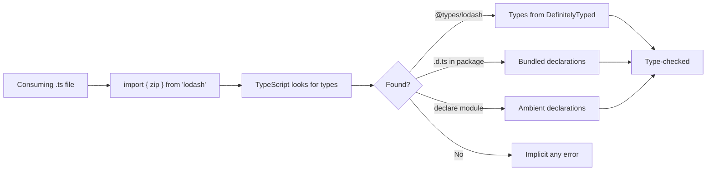

# Declaration Files and `@types`

> [!summary] Goal
> Understand `.d.ts` files, how `@types` packages work, and how to write declarations for JavaScript libraries to get full type safety.

## Table of Contents

1. [Why Declaration Files Matter](#why-declaration-files-matter)
2. [What a `.d.ts` File Looks Like](#what-a-d-ts-file-looks-like)
3. [The `declare` Keyword](#the-declare-keyword)
4. [DefinitelyTyped and `@types`](#definitelytyped-and-types)
5. [Writing Declarations for a JS Library](#writing-declarations-for-a-js-library)
6. [Global Declarations and Augmentation](#global-declarations-and-augmentation)
7. [Triple-Slash Directives](#triple-slash-directives)
8. [Publishing Types](#publishing-types)
9. [Pitfalls](#pitfalls)

---

## Why Declaration Files Matter

TypeScript understands the types of your `.ts` files. For JavaScript libraries, it needs a **declaration file** (`.d.ts`) that describes the library's API shape.



> [!tip] Definition
> **`.d.ts` file**: a declaration file containing only type information — no implementation. It describes the shape of JavaScript code to TypeScript. These files are never emitted; they exist as source or in `@types` packages.

---

## What a `.d.ts` File Looks Like

```ts
// lib.d.ts
export function formatDate(date: Date, format?: string): string;
export function parseDate(str: string): Date;

export interface DateOptions {
  locale?: string;
  timezone?: string;
}

export const VERSION: string;
```

Key differences from `.ts`:
- No function bodies (`=> string` not `{ return ... }`)
- No class implementations (just `class Foo { method(): void; }`)
- No runtime values (only `declare` or `export`)

---

## The `declare` Keyword

`declare` tells TypeScript "this exists at runtime, trust me":

```ts
// globals.d.ts
declare const API_BASE_URL: string;

declare function trackEvent(name: string, data?: object): void;

declare class Analytics {
  constructor(apiKey: string);
  pageView(path: string): void;
}
```

### `declare module`

Describe a module that has no type definitions:

```ts
// my-lib.d.ts
declare module 'my-lib' {
  export function doThing(): void;
  export const VERSION: string;
}
```

### `declare global`

Add types to the global scope from within a module:

```ts
// augment-window.d.ts
export {};  // Required — makes this a module

declare global {
  interface Window {
    __ENV: { apiUrl: string; debug: boolean };
  }
}
```

---

## DefinitelyTyped and `@types`

DefinitelyTyped is a community-maintained repository of TypeScript declaration files for thousands of JavaScript libraries.

### Finding and installing types

```bash
# For lodash
npm install --save-dev @types/lodash

# For react
npm install --save-dev @types/react

# For express
npm install --save-dev @types/express
```

### How `@types` resolution works

```json
{
  "compilerOptions": {
    "types": ["node", "express"]   // Only include these @types
  }
}
```

| `types` field | Behavior |
|---------------|----------|
| Not specified | All `@types/*` packages are included |
| `"types": []` | No `@types` are included automatically |
| `"types": ["node"]` | Only `@types/node` is included |

### Version matching

Type versions follow the library's major version:
- `@types/react@18` → React 18 types
- `@types/react@19` → React 19 types

---

## Writing Declarations for a JS Library

### Module declarations for a simple library

```ts
// node_modules/fancy-utils/index.d.ts
declare module 'fancy-utils' {
  export function capitalize(s: string): string;

  export interface FancyOptions {
    prefix?: string;
    suffix?: string;
  }

  export class FancyFormatter {
    constructor(options?: FancyOptions);
    format(s: string): string;
  }
}
```

### Declaring function overloads

```ts
declare function get(id: string): Entity | null;
declare function get(ids: string[]): Entity[];
```

### Declaring classes

```ts
declare class Database {
  constructor(connectionString: string);
  connect(): Promise<void>;
  query(sql: string): Promise<unknown[]>;
  close(): Promise<void>;
}
```

### Declaring namespaces for legacy libs

```ts
declare namespace MyLib {
  function init(config: { debug: boolean }): void;
  const VERSION: string;

  namespace Events {
    function on(event: string, handler: (...args: any[]) => void): void;
  }
}
```

---

## Global Declarations and Augmentation

### Adding properties to existing interfaces

```ts
// express-augment.d.ts
import 'express';

declare module 'express' {
  interface Request {
    user?: { id: string; role: string };
  }
}
```

```ts
// app.ts
import express from 'express';
const app = express();

app.use((req, res, next) => {
  req.user = { id: '123', role: 'admin' };  // Now typed!
  next();
});
```

### Augmenting global types

```ts
// types.d.ts
export {};

declare global {
  interface Array<T> {
    groupBy<K extends string | number | symbol>(
      keyFn: (item: T) => K
    ): Record<K, T[]>;
  }
}

// Now Array.prototype.groupBy is available everywhere
```

---

## Triple-Slash Directives

Legacy way to reference other declaration files (pre-`@types`):

```ts
/// <reference types="node" />
/// <reference path="./types.d.ts" />
/// <reference lib="es2022" />
```

| Directive | Purpose |
|-----------|---------|
| `/// <reference types="node" />` | Include `@types/node` |
| `/// <reference path="./types.d.ts" />` | Include a local file |
| `/// <reference lib="es2022" />` | Include a built-in lib |

> [!warning] Prefer `tsconfig.json` `types` field over triple-slash directives. They are primarily for `.d.ts` files that need to specify their own dependencies.

---

## Publishing Types

If you're authoring a TypeScript library, ensure your `package.json` points to the declarations:

```json
{
  "name": "my-lib",
  "version": "1.0.0",
  "main": "./dist/index.js",
  "types": "./dist/index.d.ts",
  "exports": {
    ".": {
      "import": "./dist/index.js",
      "require": "./dist/index.cjs",
      "types": "./dist/index.d.ts"
    }
  }
}
```

In `tsconfig.json`:

```json
{
  "compilerOptions": {
    "declaration": true,
    "declarationMap": true,
    "outDir": "./dist",
    "rootDir": "./src"
  }
}
```

### Testing your published types

Use `tsd` or `vitest-type-assert` to write type-level tests:

```ts
import { expectType } from 'tsd';
import { formatDate } from './index';

expectType<string>(formatDate(new Date()));
```

---

## Pitfalls

### Missing `@types` package

```ts
import { something } from 'unknown-lib';
// Error: Cannot find module 'unknown-lib'
```

**Fix**: `npm install --save-dev @types/unknown-lib` or write a `declare module 'unknown-lib'` stub.

### `declare module` path mismatch

```ts
// WRONG: path must match the import
declare module './my-lib' { ... }

// CORRECT: matches the bare specifier
declare module 'my-lib' { ... }
```

### Forgetting `export {}` for global augmentation

```ts
declare global {
  interface Window { __ENV: object }
}
// Without `export {}`, this is an ambient module (ambiguous)
```

**Fix**: Add `export {};` at the top to make it a module.

### `.d.ts` pollution from `node_modules`

Errors in third-party `.d.ts` files can be confusing. Use `skipLibCheck: true` to ignore them.

---

> [!question]- Interview Questions
>
> **Q: What is the purpose of a `.d.ts` file?**
> A: It describes the shape of JavaScript code to TypeScript without providing implementations. It enables type-checking and auto-complete for plain JS libraries.
>
> **Q: How does `@types` resolution work?**
> A: When you `npm install @types/foo`, TypeScript automatically includes it (unless you specify `"types": []` in tsconfig). The type declarations match the library version by major version number.
>
> **Q: What is the `declare` keyword used for?**
> A: `declare` tells TypeScript that a value, type, or module exists at runtime without providing an implementation. Used in `.d.ts` files for ambient declarations.
>
> **Q: How do you augment a third-party module's types?**
> A: Use `declare module 'module-name' { ... }` in a `.d.ts` file under `types` or `src/`. For global augmentation, add `declare global { ... }` inside a module (with `export {}`).

---

## Cross-Links

- [[TypeScript/01_Foundations/06_Modules_and_Imports]] for import/export syntax
- [[TypeScript/03_Advanced/05_Declaration_Merging_and_Augmentation]] for deep merging patterns
- [[TypeScript/01_Foundations/05_TS_Config_and_Compiler]] for `declaration`, `declarationMap` flags

---

## References

- [TypeScript Declaration Files](https://www.typescriptlang.org/docs/handbook/declaration-files/introduction.html)
- [DefinitelyTyped](https://github.com/DefinitelyTyped/DefinitelyTyped)
- [Publishing TypeScript Packages](https://www.typescriptlang.org/docs/handbook/declaration-files/publishing.html)
- [Triple-Slash Directives](https://www.typescriptlang.org/docs/handbook/triple-slash-directives.html)
