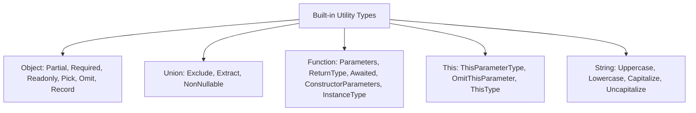

# Utility Types Deep Dive

> [!summary] Goal
> Master all 15 built-in utility types, understand their implementations, and learn to compose and create custom utility types.

## Table of Contents

1. [Why Utility Types Matter](#why-utility-types-matter)
2. [Object Utility Types](#object-utility-types)
3. [Union Utility Types](#union-utility-types)
4. [Function Utility Types](#function-utility-types)
5. [String Utility Types](#string-utility-types)
6. [Custom Utility Types](#custom-utility-types)
7. [`NoInfer<T>` (TS 5.4)](#noinfert)
8. [Composing Utilities](#composing-utilities)
9. [Pitfalls](#pitfalls)

---

## Why Utility Types Matter

Utility types are global generic types that transform other types. Understanding them is essential for writing concise, safe TypeScript.



---

## Object Utility Types

### `Partial<T>`

Makes all properties optional:

```ts
interface User { id: string; email: string; name: string; }

type PartialUser = Partial<User>;
// { id?: string; email?: string; name?: string; }

// Implementation:
type Partial<T> = { [K in keyof T]?: T[K] };
```

**Use case**: Update/PATCH APIs — only send changed fields.

### `Required<T>`

Makes all properties required:

```ts
type Config = { debug?: boolean; host?: string };
type StrictConfig = Required<Config>;
// { debug: boolean; host: string; }

// Implementation:
type Required<T> = { [K in keyof T]-?: T[K] };
```

### `Readonly<T>`

Makes all properties readonly:

```ts
type ImmutableUser = Readonly<User>;
// { readonly id: string; readonly email: string; readonly name: string; }

// Implementation:
type Readonly<T> = { readonly [K in keyof T]: T[K] };
```

### `Pick<T, K>`

Select specific keys:

```ts
type UserPublic = Pick<User, 'id' | 'name'>;
// { id: string; name: string; }

// Implementation:
type Pick<T, K extends keyof T> = { [P in K]: T[P] };
```

### `Omit<T, K>`

Remove specific keys:

```ts
type UserPrivate = Omit<User, 'password' | 'ssn'>;
// { id: string; email: string; name: string; }

// Implementation:
type Omit<T, K extends keyof any> = Pick<T, Exclude<keyof T, K>>;
```

### `Record<K, T>`

Create an object type with fixed keys and uniform value type:

```ts
type UserMap = Record<string, User>;
// { [key: string]: User }

type RouteMap = Record<'home' | 'settings' | 'profile', string>;
// { home: string; settings: string; profile: string; }

// Implementation:
type Record<K extends keyof any, T> = { [P in K]: T; };
```

---

## Union Utility Types

### `Exclude<T, U>`

Remove members of `U` from union `T`:

```ts
type T = 'a' | 'b' | 'c';
type WithoutB = Exclude<T, 'b'>;  // 'a' | 'c'

type Values = string | number | boolean;
type NoStrings = Exclude<Values, string>;  // number | boolean

// Implementation:
type Exclude<T, U> = T extends U ? never : T;
```

### `Extract<T, U>`

Keep only members of `U` from union `T`:

```ts
type T = 'a' | 'b' | 'c';
type OnlyB = Extract<T, 'b' | 'c'>;  // 'b' | 'c'

type All = string | number | boolean | null;
type Primitives = Extract<All, string | number>;  // string | number

// Implementation:
type Extract<T, U> = T extends U ? T : never;
```

### `NonNullable<T>`

Remove `null` and `undefined` from a union:

```ts
type Maybe = string | null | undefined;
type Definite = NonNullable<Maybe>;  // string

// Implementation:
type NonNullable<T> = T extends null | undefined ? never : T;
```

---

## Function Utility Types

### `Parameters<T>`

Extract parameter types as a tuple:

```ts
type Fn = (name: string, age: number) => boolean;
type Params = Parameters<Fn>;  // [string, number]

// Implementation:
type Parameters<T extends (...args: any) => any> =
  T extends (...args: infer P) => any ? P : never;
```

**Use case**: Wrapping a function with the same parameter types:

```ts
function log<T extends (...args: any[]) => any>(
  fn: T,
  ...args: Parameters<T>
): ReturnType<T> {
  console.log('Calling:', fn.name, args);
  return fn(...args);
}
```

### `ConstructorParameters<T>`

Extract constructor parameter types:

```ts
class User { constructor(id: string, name: string) {} }
type CtorParams = ConstructorParameters<typeof User>;
// [string, string]

// Implementation:
type ConstructorParameters<T extends abstract new (...args: any) => any> =
  T extends abstract new (...args: infer P) => any ? P : never;
```

### `ReturnType<T>`

Extract the return type of a function:

```ts
type Fn = (x: number) => string;
type Result = ReturnType<Fn>;  // string

// With async functions:
type AsyncResult = ReturnType<typeof fetchUser>;  // Promise<User>
type Unwrapped = Awaited<AsyncResult>;  // User

// Implementation:
type ReturnType<T extends (...args: any) => any> =
  T extends (...args: any) => infer R ? R : any;
```

### `InstanceType<T>`

Extract the instance type from a constructor type:

```ts
class User { constructor(public id: string) {} }
type Inst = InstanceType<typeof User>;  // User

// Implementation:
type InstanceType<T extends abstract new (...args: any) => any> =
  T extends abstract new (...args: any) => infer R ? R : any;
```

### `Awaited<T>`

Recursively unwrap promises:

```ts
type T = Awaited<Promise<Promise<string>>>;  // string
```

---

## String Utility Types

Intrinsic string transformation types:

```ts
type Upper = Uppercase<'hello'>;     // 'HELLO'
type Lower = Lowercase<'HELLO'>;     // 'hello'
type Cap = Capitalize<'hello'>;      // 'Hello'
type Uncap = Uncapitalize<'Hello'>;  // 'hello'
```

### Use case: event name patterns

```ts
type EventName = 'user-login' | 'user-logout' | 'page-view';

type EventHandler = `on${Capitalize<EventName>}`;
// 'onUser-login' | 'onUser-logout' | 'onPage-view'
// But note: Capitalize only capitalizes the first char after 'on-'
// Better approach with template literal parsing:
type EventHandler2 = `on${Capitalize<EventName>}`;
```

---

## Custom Utility Types

Using mapped, conditional, and template literal types together:

### `DeepPartial<T>`

```ts
type DeepPartial<T> = T extends object
  ? { [P in keyof T]?: DeepPartial<T[P]> }
  : T;

interface Config {
  nested: { a: number; b: string };
}
type Deep = DeepPartial<Config>;
// { nested?: { a?: number; b?: string } }
```

### `Mutable<T>`

```ts
type Mutable<T> = { -readonly [P in keyof T]: T[P] };

type Immutable = Readonly<{ a: number; b: string }>;
type NowMutable = Mutable<Immutable>;
// { a: number; b: string }
```

### `UnionToIntersection<U>`

```ts
type UnionToIntersection<U> =
  (U extends any ? (x: U) => void : never) extends
  (x: infer I) => void ? I : never;

type T = UnionToIntersection<{ a: number } | { b: string }>;
// { a: number } & { b: string }
```

### `KeysOfType<T, V>`

```ts
type KeysOfType<T, V> = {
  [K in keyof T]: T[K] extends V ? K : never;
}[keyof T];

interface User { id: string; name: string; age: number; active: boolean; }
type StringKeys = KeysOfType<User, string>;  // 'id' | 'name'
```

---

## `NoInfer<T>` (TS 5.4)

`NoInfer<T>` prevents TypeScript from inferring a type argument from that position:

```ts
function create<T extends string>(value: T, items: NoInfer<T>[]): T {
  return items.includes(value) ? value : items[0];
}

// T is inferred from 'value', not 'items':
const result = create('hello', ['hello', 'world']);  // T = 'hello'

// Without NoInfer, T would widen to string (the broadest common type)
```

---

## Composing Utilities

```ts
// Build complex types by combining utilities:

// 1. Partial + Pick: "update only these fields"
type UpdatePayload<T, K extends keyof T> = Partial<Pick<T, K>>;

// 2. Omit + Partial: "PATCH body"
type PatchBody<T> = Partial<Omit<T, 'id' | 'createdAt'>>;

// 3. DeepReadonly
type DeepReadonly<T> = {
  readonly [P in keyof T]: T[P] extends object ? DeepReadonly<T[P]> : T[P];
};

// 4. AsyncReturnType
type AsyncReturnType<T extends (...args: any) => any> =
  Awaited<ReturnType<T>>;
```

---

## Pitfalls

### `Omit` doesn't distribute over unions

```ts
type T = { a: string } | { b: number };
type Omitted = Omit<T, 'a'>;  // never — Omit doesn't distribute
```

**Fix**: Use a distributive conditional type:

```ts
type DistributiveOmit<T, K extends keyof any> =
  T extends any ? Omit<T, K> : never;
```

### `Partial` makes everything optional — even required fields

```ts
interface Config { host: string; port: number; }
type Optional = Partial<Config>;

const c: Optional = {};  // OK — but at runtime this fails
```

**Fix**: Use `Pick` + `Partial` for selective optionality.

### `Record<string, T>` doesn't know specific keys

```ts
const map: Record<string, number> = {};
map.anything = 42;  // OK — but no autocomplete on `anything`
```

**Fix**: If keys are known, use a mapped type or `{[K in 'a'|'b']: T}`.

---

> [!question]- Interview Questions
>
> **Q: What are the 15 built-in utility types?**
> A: Object: `Partial`, `Required`, `Readonly`, `Pick`, `Omit`, `Record`. Union: `Exclude`, `Extract`, `NonNullable`. Function: `Parameters`, `ReturnType`, `Awaited`, `ConstructorParameters`, `InstanceType`. String: `Uppercase`, `Lowercase`, `Capitalize`, `Uncapitalize`. This: `ThisParameterType`, `OmitThisParameter`, `ThisType`. (21 total across all categories.)
>
> **Q: How is `Omit<T, K>` implemented?**
> A: `type Omit<T, K extends keyof any> = Pick<T, Exclude<keyof T, K>>`. It excludes keys `K` from `T` by picking all keys except `K`.
>
> **Q: What does `NoInfer<T>` do?**
> A: It prevents TypeScript from using that position for type inference. Useful when you want to force inference from one parameter only.
>
> **Q: How would you create a `DeepPartial` type?**
> A: `type DeepPartial<T> = T extends object ? { [P in keyof T]?: DeepPartial<T[P]> } : T;`. It recursively wraps nested objects in `Partial`.

---

## Cross-Links

- [[TypeScript/02_Core/01_Utility_Types]] for the introductory utility types file
- [[TypeScript/03_Advanced/01_Conditional_Types]] for conditional utility implementations
- [[TypeScript/03_Advanced/02_Mapped_Types]] for mapped utility implementations
- [[TypeScript/03_Advanced/03_Infer_and_Template_Literal_Types]] for `infer` in utilities

---

## References

- [TypeScript Utility Types](https://www.typescriptlang.org/docs/handbook/utility-types.html)
- [TypeScript 5.4 NoInfer](https://devblogs.microsoft.com/typescript/announcing-typescript-5-4/#the-noinfer-utility-type)
- [TypeScript Playground: Utility Types](https://www.typescriptlang.org/play#example/utility-types)
