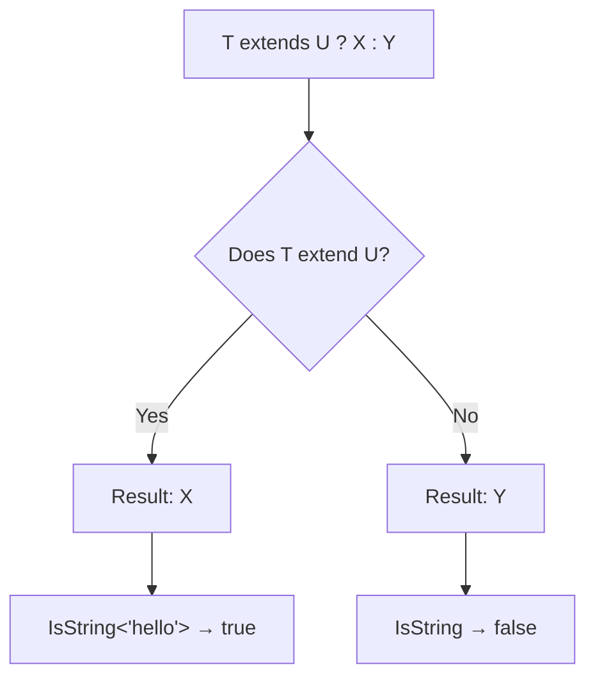
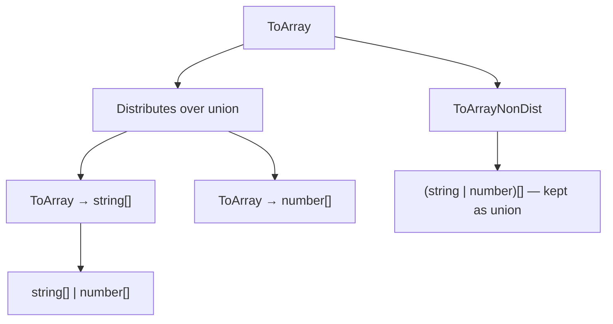

# Conditional Types

> [!summary] Goal
> Compute types from other types using conditions — the foundation of type-level programming in TypeScript.

## Table of Contents

1. [Why Conditional Types Matter](#why-conditional-types-matter)
2. [Basic Conditional Types](#basic-conditional-types)
3. [Distributive Behavior Over Unions](#distributive-behavior-over-unions)
4. [Nested Conditional Types](#nested-conditional-types)
5. [`infer` in Conditional Types](#infer-in-conditional-types)
6. [Common Conditional Type Patterns](#common-conditional-type-patterns)
7. [Pitfalls](#pitfalls)

---

## Why Conditional Types Matter

Conditional types select between two types based on a condition, enabling type-level computations:



---

## Basic Conditional Types

```ts
type IsString<T> = T extends string ? true : false;

type A = IsString<'hello'>;  // true
type B = IsString<42>;       // false
type C = IsString<true>;     // false
```

### Type-level equality

```ts
type Equal<A, B> = A extends B ? (B extends A ? true : false) : false;

type E1 = Equal<string, string>;   // true
type E2 = Equal<string, number>;   // false
type E3 = Equal<{ a: string }, { a: string; b: number }>; // false (structural)
```

---

## Distributive Behavior Over Unions

When a conditional type is applied to a **union**, it distributes — the condition is applied to each member individually:

```ts
type ToArray<T> = T extends unknown ? T[] : never;

type Result = ToArray<string | number>;
// Evaluates as: (string extends unknown ? string[] : never) |
//               (number extends unknown ? number[] : never)
// Result: string[] | number[]

// Without distribution (wrap in tuple):
type ToArrayNonDist<T> = [T] extends [unknown] ? T[] : never;
type Result2 = ToArrayNonDist<string | number>;
// (string | number)[]
```



### Disabling distribution

Wrap the checked type in a tuple `[T]` to prevent distribution:

```ts
type IsUnion<T, U = T> =
  T extends any ? ([U] extends [T] ? false : true) : never;

type Test1 = IsUnion<string>;           // false
type Test2 = IsUnion<string | number>;  // true
```

---

## Nested Conditional Types

```ts
type TypeOfValue<T> =
  T extends string ? 'string' :
  T extends number ? 'number' :
  T extends boolean ? 'boolean' :
  T extends null ? 'null' :
  T extends undefined ? 'undefined' :
  T extends Function ? 'function' :
  T extends any[] ? 'array' :
  'object';

type T1 = TypeOfValue<'hello'>;    // 'string'
type T2 = TypeOfValue<42>;         // 'number'
type T3 = TypeOfValue<true>;       // 'boolean'
type T4 = TypeOfValue<() => void>; // 'function'
type T5 = TypeOfValue<[1, 2]>;     // 'array'
```

### Chained conditional with infer

```ts
type DeepType<T> =
  T extends Promise<infer U> ? DeepType<U> :
  T extends Array<infer U> ? DeepType<U> :
  T extends Map<string, infer V> ? DeepType<V> :
  T extends Set<infer U> ? DeepType<U> :
  T;

type Deep = DeepType<Promise<Promise<number[]>>>;
// number
```

---

## `infer` in Conditional Types

`infer` lets you **extract** a type from within a larger type:

```ts
// Extract the element type from an array
type ElementType<T> = T extends (infer U)[] ? U : T;

type E1 = ElementType<string[]>;  // string
type E2 = ElementType<number[]>;  // number
type E3 = ElementType<boolean>;   // boolean (not an array)
```

### `infer` in function types

```ts
type ReturnOf<T> = T extends (...args: any[]) => infer R ? R : never;

type R1 = ReturnOf<() => string>;            // string
type R2 = ReturnOf<(x: number) => boolean>;  // boolean
```

### `infer` from multiple positions

```ts
type FirstAndRest<T> =
  T extends [infer First, ...infer Rest] ? { first: First; rest: Rest } : never;

type FR = FirstAndRest<[string, number, boolean]>;
// { first: string; rest: [number, boolean] }
```

### `infer` method return type

```ts
type MethodReturn<T, M extends keyof T> =
  T[M] extends (...args: any[]) => infer R ? R : never;

type User = { getName(): string; getAge(): number };
type NameReturn = MethodReturn<User, 'getName'>;  // string
```

---

## Common Conditional Type Patterns

### `NonNullable` (built-in)

```ts
type NonNullable<T> = T extends null | undefined ? never : T;
type T = NonNullable<string | null | undefined>;  // string
```

### `Exclude` (built-in)

```ts
type Exclude<T, U> = T extends U ? never : T;
type T = Exclude<'a' | 'b' | 'c', 'a'>;  // 'b' | 'c'
```

### `Extract` (built-in)

```ts
type Extract<T, U> = T extends U ? T : never;
type T = Extract<'a' | 'b' | 'c', 'a' | 'b'>;  // 'a' | 'b'
```

### `IsNever` — special case

```ts
type IsNever<T> = [T] extends [never] ? true : false;
type T1 = IsNever<never>;     // true
type T2 = IsNever<string>;    // false
// Note: `T extends never ? true : false` DOES NOT WORK for never
// because never distributes over nothing — wrap in tuple to prevent
```

---

## Pitfalls

### Distribution with `never`

```ts
type Bad = never extends string ? true : false;  // true (never extends everything)

type Distributes<T> = T extends string ? true : false;
type T = Distributes<never>;  // never (distributes over empty union = nothing)
```

**Fix**: Wrap in tuple: `type NonDist<T> = [T] extends [string] ? true : false;`

### Naked type parameter distribution

```ts
type Filter<T, U> = T extends U ? never : T;
// T must be a "naked" type parameter to distribute
// Wrapping in [T] prevents distribution

type FilterNonDist<T, U> = [T] extends [U] ? never : T;
```

### Order of conditions matters

```ts
type WhatIs<T> =
  T extends string ? 'string' :
  T extends 'hello' ? 'hello' :  // This branch is NEVER reached for string
  'other';
```

**Fix**: Put more specific conditions before more general ones.

---

> [!question]- Interview Questions
>
> **Q: What is a conditional type?**
> A: A type that selects between two alternatives based on a condition: `T extends U ? X : Y`. If `T` satisfies `U`, the result is `X`; otherwise `Y`.
>
> **Q: What is distributive behavior in conditional types?**
> A: When `T` is a union and a naked type parameter, the condition applies to each union member individually. `ToArray<string | number>` becomes `string[] | number[]`. Wrap in `[T]` to disable.
>
> **Q: What does `infer` do in conditional types?**
> A: `infer` declares a type variable within the `extends` clause that captures a part of the matched type. Used in patterns like `T extends (infer U)[] ? U : T`.
>
> **Q: Why does `never` behave differently in conditional types?**
> A: `never` is the empty union. When distributed, `Distributes<never>` returns `never`. To check for `never`, wrap in a tuple: `[T] extends [never]`.

---

## Cross-Links

- [[TypeScript/02_Core/01_Utility_Types]] for utility types built on conditionals
- [[TypeScript/02_Core/09_Utility_Types_Deep_Dive]] for custom utility type implementations
- [[TypeScript/03_Advanced/03_Infer_and_Template_Literal_Types]] for infer patterns

---

## References

- [TypeScript Conditional Types](https://www.typescriptlang.org/docs/handbook/2/conditional-types.html)
- [Distributive Conditional Types](https://www.typescriptlang.org/docs/handbook/2/conditional-types.html#distributive-conditional-types)
- [[infer Keyword](https://www.typescriptlang.org/docs/handbook/2/conditional-types.html#inferring-within-conditional-types)
