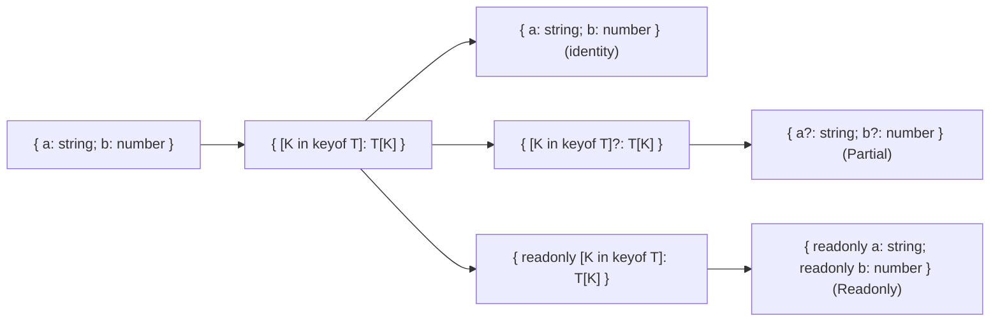
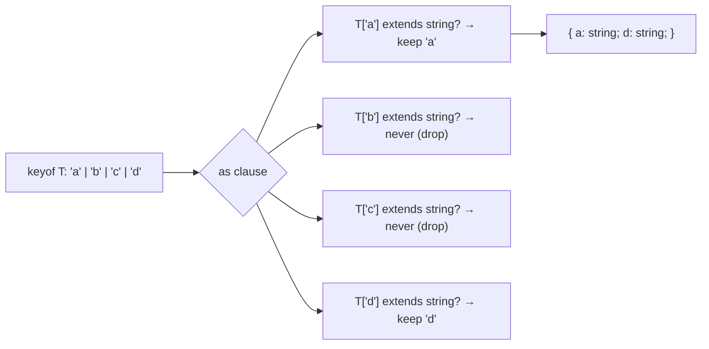

# Mapped Types

> [!summary] Goal
> Transform object types by iterating over their keys — adding, removing, or modifying properties with mapped types and key remapping.

## Table of Contents

1. [Why Mapped Types Matter](#why-mapped-types-matter)
2. [Basic Mapped Types](#basic-mapped-types)
3. [Modifiers: `?`, `readonly`, `-`, `+`](#modifiers-readonly)
4. [Key Remapping with `as`](#key-remapping-with-as)
5. [Filtering and Transforming Keys](#filtering-and-transforming-keys)
6. [Composing Mapped Types](#composing-mapped-types)
7. [Pitfalls](#pitfalls)

---

## Why Mapped Types Matter

Mapped types iterate over the keys of an existing type to create a new type:



---

## Basic Mapped Types

```ts
type MyPartial<T> = { [K in keyof T]?: T[K] };
type MyReadonly<T> = { readonly [K in keyof T]: T[K] };

interface User { id: string; email: string; name: string; }

type PartialUser = MyPartial<User>;
// { id?: string; email?: string; name?: string }
```

### How TypeScript's built-in utilities are defined

```ts
type Partial<T> = { [K in keyof T]?: T[K] };
type Required<T> = { [K in keyof T]-?: T[K] };
type Readonly<T> = { readonly [K in keyof T]: T[K] };
```

---

## Modifiers: `?`, `readonly`, `-`, `+`

### Adding modifiers

```ts
type Optional<T> = { [K in keyof T]?: T[K] };       // add ?
type Immutable<T> = { readonly [K in keyof T]: T[K] };  // add readonly
```

### Removing modifiers

```ts
type Concrete<T> = { [K in keyof T]-?: T[K] };         // remove ?
type Mutable<T> = { -readonly [K in keyof T]: T[K] };  // remove readonly
```

```ts
interface Config { host?: string; port?: number; readonly id: string; }

type RequiredConfig = Concrete<Config>;
// { host: string; port: number; id: string }  — readonly also kept

type MutableConfig = Mutable<Config>;
// { host?: string; port?: number; id: string }  — ? still there, readonly gone

type FullyRequired = Mutable<Concrete<Config>>;
// { host: string; port: string; id: string }  — both modifiers removed
```

---

## Key Remapping with `as`

Since TypeScript 4.1, you can remap keys using the `as` clause:

```ts
// Add a prefix to all keys
type Prefixed<T, P extends string> = {
  [K in keyof T as `${P}${Capitalize<string & K>}`]: T[K]
};

interface User { name: string; age: number; }
type ApiUser = Prefixed<User, 'user'>;
// { userName: string; userAge: number; }
```

### Filtering keys

```ts
// Keep only string-valued properties
type StringProps<T> = {
  [K in keyof T as T[K] extends string ? K : never]: T[K]
};

interface Mixed { a: string; b: number; c: boolean; d: string; }
type OnlyStrings = StringProps<Mixed>;
// { a: string; d: string; }
```



### Transforming keys

```ts
type Getters<T> = {
  [K in keyof T as `get${Capitalize<string & K>}`]: () => T[K]
};

type UserGetters = Getters<{ name: string; age: number }>;
// { getName: () => string; getAge: () => number }
```

### Renaming specific keys

```ts
type Rename<T, Old extends keyof T, New extends string> = {
  [K in keyof T as K extends Old ? New : K]: T[K]
};

type Renamed = Rename<{ id: string; name: string }, 'id', 'userId'>;
// { userId: string; name: string; }
```

---

## Filtering and Transforming Keys

### Pick by value type (filter + remap)

```ts
type PickByType<T, V> = {
  [K in keyof T as T[K] extends V ? K : never]: T[K]
};

type StringFields = PickByType<{ a: string; b: number; c: string }, string>;
// { a: string; c: string }
```

### Omit by value type

```ts
type OmitByType<T, V> = {
  [K in keyof T as T[K] extends V ? never : K]: T[K]
};

type NonStringFields = OmitByType<{ a: string; b: number; c: boolean }, string>;
// { b: number; c: boolean }
```

### Make all nested properties optional

```ts
type DeepPartial<T> = T extends object
  ? { [P in keyof T]?: DeepPartial<T[P]> }
  : T;

interface Nested { user: { name: string; address: { city: string } }; }
type PartialNested = DeepPartial<Nested>;
// { user?: { name?: string; address?: { city?: string } } }
```

---

## Composing Mapped Types

```ts
// Strip readonly from all properties
type Mutable<T> = { -readonly [K in keyof T]: T[K] };

// Make all properties required + mutable
type ConcreteMutable<T> = Mutable<Required<T>>;

// Add prefix to keys of optional properties only
type OptionalKeys<T> = {
  [K in keyof T as {} extends Pick<T, K> ? `optional${Capitalize<string & K>}` : never]: T[K]
};
```

---

## Pitfalls

### Mapped types over `interface` with call signatures

```ts
interface HasMethod {
  (): void;
  value: number;
}

// Mapped types only see explicitly declared properties
type Mapped = { [K in keyof HasMethod]: HasMethod[K] };
// { value: number; }  — call signature is NOT included
```

### `keyof` on mapped types

```ts
type Optional<T> = { [K in keyof T]?: T[K] };
type Keys = keyof Optional<{ a: string; b: number }>;
// 'a' | 'b'  — same as the original, even though optional now
```

### Remapping with non-string keys

```ts
type SymbolKeys = { [K in keyof { [x: symbol]: string }]: string };
// Symbol keys are preserved but can't be remapped with template literals
```

---

> [!question]- Interview Questions
>
> **Q: What is a mapped type?**
> A: A type that iterates over the keys of an existing type using `[K in keyof T]` to create a new object type. It can add, remove, or modify property modifiers and transform the value types.
>
> **Q: How does key remapping with `as` work?**
> A: `[K in keyof T as NewKey]` lets you transform, filter, or rename keys. `as never` removes the key, `as \`prefix${K}\`` renames it.
>
> **Q: How do you remove the `?` modifier from all properties?**
> A: Use the `-?` syntax: `type Required<T> = { [K in keyof T]-?: T[K] }`. Similarly, `-readonly` removes readonly.
>
> **Q: Can mapped types transform nested objects?**
> A: Yes, but you need a recursive mapped type: `type DeepPartial<T> = T extends object ? { [P in keyof T]?: DeepPartial<T[P]> } : T;`.

---

## Cross-Links

- [[TypeScript/02_Core/01_Utility_Types]] for built-in mapped utilities
- [[TypeScript/02_Core/09_Utility_Types_Deep_Dive]] for custom mapped utilities
- [[TypeScript/03_Advanced/03_Infer_and_Template_Literal_Types]] for template literal key patterns
- [[TypeScript/01_Foundations/01_TS_Basics_Types_and_Inference]] for `satisfies` with mapped types

---

## References

- [TypeScript Mapped Types](https://www.typescriptlang.org/docs/handbook/2/mapped-types.html)
- [Key Remapping in Mapped Types](https://www.typescriptlang.org/docs/handbook/2/mapped-types.html#key-remapping-via-as)
- [Template Literal Types for Key Transformation](https://www.typescriptlang.org/docs/handbook/2/template-literal-types.html)
