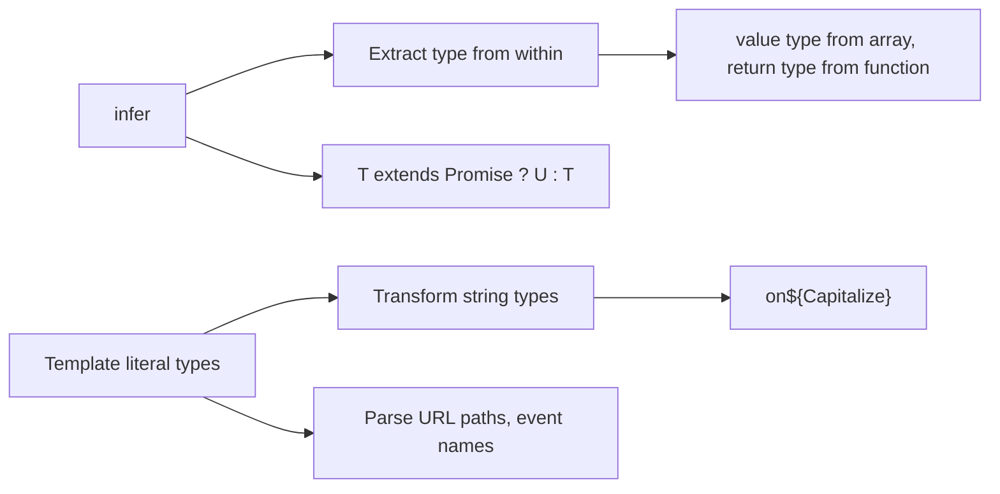

# `infer` and Template Literal Types

> [!summary] Goal
> Extract types from within larger structures using `infer`, and transform string types at the type level using template literals and intrinsic string types.

## Table of Contents

1. [Why `infer` and Template Literals Matter](#why-infer-and-template-literals-matter)
2. [`infer` in Conditional Types](#infer-in-conditional-types)
3. [`infer` in Tuple Types](#infer-in-tuple-types)
4. [Template Literal Types](#template-literal-types)
5. [Intrinsic String Types](#intrinsic-string-types)
6. [Parsing with Template Literals](#parsing-with-template-literals)
7. [Combining `infer` with Template Literals](#combining-infer-with-template-literals)
8. [Pitfalls](#pitfalls)

---

## Why `infer` and Template Literals Matter

`infer` lets you extract and capture types from within other types. Template literal types let you manipulate string types at the type level:



---

## `infer` in Conditional Types

`infer` declares a type variable in the `extends` clause that captures a part of the matched type:

### Extract promise value

```ts
type UnwrapPromise<T> = T extends Promise<infer U> ? U : T;

type A = UnwrapPromise<Promise<number>>;  // number
type B = UnwrapPromise<Promise<string>>;  // string
type C = UnwrapPromise<number>;           // number (not a promise)
```

### Extract array element type

```ts
type ElementType<T> = T extends (infer U)[] ? U : T;

type E1 = ElementType<string[]>;   // string
type E2 = ElementType<number[]>;   // number
type E3 = ElementType<boolean>;    // boolean
```

### Extract function return type

```ts
type ReturnType<T> = T extends (...args: any[]) => infer R ? R : never;

type R1 = ReturnType<() => string>;           // string
type R2 = ReturnType<(x: number) => boolean>; // boolean
```

### Extract function parameters

```ts
type Parameters<T> = T extends (...args: infer P) => any ? P : never;

type P1 = Parameters<(name: string, age: number) => void>;
// [string, number]
```

---

## `infer` in Tuple Types

### Extract first element

```ts
type First<T extends unknown[]> = T extends [infer F, ...unknown[]] ? F : never;

type F1 = First<[string, number, boolean]>;  // string
type F2 = First<[number]>;                   // number
type F3 = First<[]>;                         // never
```

### Extract last element

```ts
type Last<T extends unknown[]> =
  T extends [...unknown[], infer L] ? L : never;

type L1 = Last<[string, number, boolean]>;  // boolean
```

### Extract from middle

```ts
type Second<T extends unknown[]> =
  T extends [unknown, infer S, ...unknown[]] ? S : never;

type S1 = Second<[string, number, boolean]>;  // number
```

### Infer rest

```ts
type Tail<T extends unknown[]> =
  T extends [unknown, ...infer Rest] ? Rest : [];

type T1 = Tail<[string, number, boolean]>;  // [number, boolean]
```

---

## Template Literal Types

Template literal types create string types by concatenating literal types:

```ts
type Greeting = `Hello, ${string}!`;
// Greeting: `Hello, ${string}!` — any string that starts/ends correctly

type EventName = `on${Capitalize<string>}`;
// EventName: `on${Capitalize<string>}` — any string starting with "on" + captial
```

### Combining with union types

```ts
type Size = 'small' | 'medium' | 'large';
type Color = 'red' | 'green' | 'blue';

type ProductOption = `${Size}-${Color}`;
// 'small-red' | 'small-green' | 'small-blue' | 'medium-red' | ...

// Template literals distribute over unions!
```

### Extracting with template literal patterns

```ts
type ExtractRouteParam<T> =
  T extends `${string}:${infer Param}/${infer Rest}`
    ? Param | ExtractRouteParam<`/${Rest}`>
    : T extends `${string}:${infer Param}`
      ? Param
      : never;

type RouteParams = ExtractRouteParam<'/users/:userId/posts/:postId'>;
// 'userId' | 'postId'
```

---

## Intrinsic String Types

TypeScript provides four built-in string transformation types:

```ts
type Upper = Uppercase<'hello'>;     // 'HELLO'
type Lower = Lowercase<'HELLO'>;     // 'hello'
type Cap = Capitalize<'hello'>;      // 'Hello'
type Uncap = Uncapitalize<'Hello'>;  // 'hello'
```

### Practical use cases

```ts
// Creating event handler names from event names
type EventName = 'click' | 'focus' | 'blur';
type HandlerName = `on${Capitalize<EventName>}`;
// 'onClick' | 'onFocus' | 'onBlur'

// Creating CSS class variants
type Variant = 'primary' | 'secondary' | 'danger';
type CssClass = `${Lowercase<Variant>}-button`;
// 'primary-button' | 'secondary-button' | 'danger-button'

// Converting API response fields to camelCase
type ApiField = 'user_id' | 'created_at' | 'updated_at';
type ToCamelCase<S extends string> =
  S extends `${infer T}_${infer U}`
    ? `${T}${Capitalize<ToCamelCase<U>>}`
    : S;

type CamelField = ToCamelCase<ApiField>;
// 'userId' | 'createdAt' | 'updatedAt'
```

---

## Parsing with Template Literals

### Parse a URL path

```ts
type ParsePath<T extends string> =
  T extends `${infer Segment}/${infer Rest}`
    ? [Segment, ...ParsePath<Rest>]
    : [T];

type PathSegments = ParsePath<'/users/123/posts'>;
// ['', 'users', '123', 'posts']  — includes leading slash segment
```

### Parse a CSS property

```ts
type CssDeclaration = `margin-top: ${number}px`;
const valid: CssDeclaration = 'margin-top: 10px';  // OK
// const invalid: CssDeclaration = 'width: 100px';  // Error
```

### Parse query string parameters

```ts
type ExtractQueryParams<T extends string> =
  T extends `${infer Base}?${infer Query}`
    ? { base: Base; query: Query }
    : { base: T; query: '' };

type Result = ExtractQueryParams<'/api/users?page=1&limit=10'>;
// { base: '/api/users'; query: 'page=1&limit=10' }
```

---

## Combining `infer` with Template Literals

### Strongly typed event emitter

```ts
type EventMap = {
  'user:created': { userId: string };
  'user:updated': { userId: string; changes: string[] };
  'system:error': { message: string };
};

type EventName = keyof EventMap;

// Extract the namespace from an event name
type EventNamespace<T extends string> =
  T extends `${infer NS}:${string}` ? NS : never;

type Namespace = EventNamespace<'user:created'>;  // 'user'
```

### Parsing route params with types

```ts
type RouteParams<T extends string> =
  T extends `${string}:${infer Param}/${infer Rest}`
    ? { [K in Param | keyof RouteParams<`/${Rest}`>]: string }
    : T extends `${string}:${infer Param}`
      ? { [K in Param]: string }
      : {};

type UserRoute = RouteParams<'/users/:userId/posts/:postId'>;
// { userId: string; postId: string; }
```

---

## Pitfalls

### `infer` is always in the `extends` clause

```ts
// WRONG — infer outside extends
// type Bad<T> = infer U;

// CORRECT
type Good<T> = T extends Promise<infer U> ? U : T;
```

### Multiple `infer` with same name

```ts
type Dual<T> = T extends { a: infer U; b: infer U } ? U : never;
// Both infer declarations create the same U — acts as a union
```

### Template literal recursion limit

Deeply recursive template literal types hit TypeScript's recursion limit (~50 levels). For deep parsing, consider syntax trees.

### Template literals with non-string types

```ts
type Mixed = `${number}-${boolean}`;
// Works: '42-true' | '0-false' | etc.
// But the generated union can be very large
```

---

> [!question]- Interview Questions
>
> **Q: What does `infer` do in a conditional type?**
> A: `infer U` declares a type variable `U` within the `extends` clause that captures part of the matched type. For example, `T extends Promise<infer U> ? U : never` extracts the resolved type from a Promise.
>
> **Q: What are template literal types?**
> A: Types that create string types by concatenating literal types and type variables. For example, `` `on${Capitalize<EventName>}` `` creates event handler names from event name unions.
>
> **Q: What are the four intrinsic string types?**
> A: `Uppercase<T>`, `Lowercase<T>`, `Capitalize<T>`, and `Uncapitalize<T>`. They transform string literal types at the type level.
>
> **Q: Can you parse a URL path with template literal types?**
> A: Yes, using recursive template literal types with `infer`. You can extract path segments, query parameters, and route parameters at the type level.

---

## Cross-Links

- [[TypeScript/03_Advanced/01_Conditional_Types]] for `infer` in conditional types
- [[TypeScript/02_Core/09_Utility_Types_Deep_Dive]] for `ReturnType` and `Parameters` utilities built on `infer`
- [[TypeScript/04_Playbooks/06_TypeScript_with_React]] for event handler naming patterns
- [[TypeScript/03_Advanced/05_Declaration_Merging_and_Augmentation]] for global augmentation with template literal types

---

## References

- [TypeScript `infer` Keyword](https://www.typescriptlang.org/docs/handbook/2/conditional-types.html#inferring-within-conditional-types)
- [Template Literal Types](https://www.typescriptlang.org/docs/handbook/2/template-literal-types.html)
- [Intrinsic String Types](https://www.typescriptlang.org/docs/handbook/2/template-literal-types.html#intrinsic-string-manipulation-types)
- [TypeScript 4.1 Template Literal Types](https://devblogs.microsoft.com/typescript/announcing-typescript-4-1/#template-literal-types)
