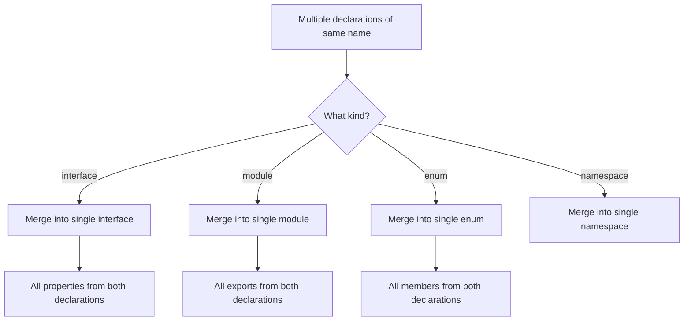

# Declaration Merging and Augmentation

> [!summary] Goal
> Extend existing types from libraries or the global scope using declaration merging, module augmentation, and global augmentation — safely and predictably.

## Table of Contents

1. [Why Declaration Merging Matters](#why-declaration-merging-matters)
2. [Interface Merging](#interface-merging)
3. [Module Augmentation](#module-augmentation)
4. [Global Augmentation](#global-augmentation)
5. [Enum Merging](#enum-merging)
6. [Namespace Merging](#namespace-merging)
7. [Limitations and Ordering](#limitations-and-ordering)
8. [Pitfalls](#pitfalls)

---

## Why Declaration Merging Matters

TypeScript merges multiple declarations of the same name into a single definition. This enables extending types from libraries without modifying the library itself.



---

## Interface Merging

Interfaces with the same name in the same scope are automatically merged:

```ts
// First declaration
interface User {
  id: string;
  email: string;
}

// Second declaration — merged
interface User {
  name: string;
  age?: number;
}

// Result:
// interface User {
//   id: string;
//   email: string;
//   name: string;
//   age?: number;
// }

const u: User = {
  id: '1',
  email: 'a@b.com',
  name: 'Alice',
};
```

### Conflicting property types

If two interfaces declare the same property with different types, they must be compatible:

```ts
interface A { x: string; }
// interface A { x: number; }  // Error: Subsequent property declarations must have the same type
```

### Merging with generics

```ts
interface Box<T> {
  value: T;
}

interface Box<T> {
  label: string;
}

// Result: Box<T> has value: T AND label: string
```

---

## Module Augmentation

Augment types from third-party modules:

```ts
// augment-express.d.ts
import 'express';

declare module 'express' {
  interface Request {
    user?: {
      id: string;
      role: 'admin' | 'user';
    };
  }
}
```

```ts
// app.ts
import express from 'express';

const app = express();
app.use((req, res, next) => {
  req.user = { id: '123', role: 'admin' };  // typed!
  next();
});
```

### Augmenting function modules

```ts
// lodash-augment.d.ts
import 'lodash';

declare module 'lodash' {
  interface LoDashStatic {
    groupBy<T, K extends string | number | symbol>(
      collection: T[],
      keyFn: (item: T) => K
    ): Record<K, T[]>;
  }
}
```

### Requirements for module augmentation

```ts
// The file must be a module (have at least one import/export)
import 'some-module';

declare module 'some-module' {
  // Add types here
}

// Or use `export {}` to make the file a module
export {};
// Then you can augment any module
```

---

## Global Augmentation

Add types to the global scope from within a module file:

```ts
// global.d.ts (or any .ts file with `export {}`)
export {};

declare global {
  // Extend existing global interfaces
  interface Window {
    __APP_CONFIG__: { apiUrl: string; debug: boolean };
  }

  // Add new global variables
  const API_VERSION: string;

  // Extend Array
  interface Array<T> {
    first(): T | undefined;
  }
}
```

```ts
// Now available everywhere:
console.log(window.__APP_CONFIG__.apiUrl);  // typed!
const result = [1, 2, 3].first();           // number | undefined
```

### Augmenting built-in JS types

```ts
export {};

declare global {
  interface String {
    toCapitalized(): string;
  }
}

// Implementation (may need type assertion):
String.prototype.toCapitalized = function () {
  return this.charAt(0).toUpperCase() + this.slice(1);
};
```

---

## Enum Merging

Enums with the same name are merged — but must share the same initializer strategy:

```ts
enum Color {
  Red = 'RED',
  Green = 'GREEN',
}

enum Color {
  Blue = 'BLUE',
}

// Result:
// enum Color {
//   Red = 'RED',
//   Green = 'GREEN',
//   Blue = 'BLUE',
// }
```

> [!warning] Enum merging is rare in practice. Prefer separate enums or union types.

---

## Namespace Merging

`namespace` merges with functions, classes, and enums that share its name:

```ts
// Namespace + function merging
function validate(value: string): boolean {
  return value.length > 0;
}

namespace validate {
  export const defaultMessage = 'Value is required';
}

validate('hello');                  // function call
validate.defaultMessage;            // namespace property
```

```ts
// Namespace + class merging
class User {
  constructor(public name: string) {}
}

namespace User {
  export const DEFAULT_NAME = 'Guest';
  export const createGuest = () => new User(DEFAULT_NAME);
}

const guest = User.createGuest();
guest.name;  // 'Guest'
```

---

## Limitations and Ordering

### What cannot be merged

| Construct | Can merge? | Notes |
|-----------|-----------|-------|
| `interface` | ✅ Yes | Property-only, no conflicting types |
| `type` alias | ❌ No | `type` cannot be merged — must be unique |
| `class` | ❌ No (with itself) | Classes cannot be redeclared |
| `enum` | ✅ Yes | With other enums of the same name |
| `namespace` | ✅ Yes | With functions, classes, enums, or other namespaces |
| `module` declaration | ✅ Yes | `declare module 'x'` can appear multiple times |

### Order of merging

Declarations are order-independent — all declarations contribute equally:

```ts
// Order doesn't matter for merging
interface A { x: number; }
interface A { y: number; }
// Result always has both x and y
```

But namespace/function/class merging has constraints — the function/class/enum declaration must come first.

---

## Pitfalls

### Accidental global augmentation

```ts
// BAD — no export = ambient module, pollutes global
interface Window {
  __ENV: object;
}

// GOOD — explicit export makes it a proper module
export {};
declare global {
  interface Window { __ENV: object; }
}
```

### Augmentation not being picked up

If your `.d.ts` augmentation file isn't loaded:

```ts
// File is not included in tsconfig → augmentation doesn't apply
```

**Fix**: Ensure the file is in the `include` list or referenced by one of your source files.

### Conflicting library augmentations

Two `@types` packages may augment the same global interface differently. Use `skipLibCheck: true` to avoid cascading errors.

### `declare module` path must match exactly

```ts
// WRONG: path is not the bare specifier
declare module './lodash' { ... }

// CORRECT: matches `import ... from 'lodash'`
declare module 'lodash' { ... }
```

---

> [!question]- Interview Questions
>
> **Q: What is declaration merging?**
> A: TypeScript merges multiple declarations of the same interface, namespace, or enum into a single definition. Interface properties from all declarations are combined.
>
> **Q: How do you augment a third-party module's types?**
> A: Use `declare module 'module-name' { ... }` in a `.ts` or `.d.ts` file that is included by tsconfig. The file must be a module (have an `import` or `export`).
>
> **Q: What is the difference between module augmentation and global augmentation?**
> A: Module augmentation (`declare module 'x'`) extends types within a specific module. Global augmentation (`declare global { }`) extends the global scope (Window, Array, etc.) and must be inside a module.
>
> **Q: What types cannot be merged?**
> A: `type` aliases cannot be redeclared. Classes cannot be redeclared (but can merge with namespaces).

---

## Cross-Links

- [[TypeScript/02_Core/04_Types_vs_Interfaces]] for `type` vs `interface` declaration merging differences
- [[TypeScript/02_Core/07_Declaration_Files_and_AtTypes]] for `.d.ts` file patterns
- [[TypeScript/01_Foundations/06_Modules_and_Imports]] for module syntax

---

## References

- [TypeScript Declaration Merging](https://www.typescriptlang.org/docs/handbook/declaration-merging.html)
- [Module Augmentation](https://www.typescriptlang.org/docs/handbook/declaration-merging.html#module-augmentation)
- [Global Augmentation](https://www.typescriptlang.org/docs/handbook/declaration-merging.html#global-augmentation)
