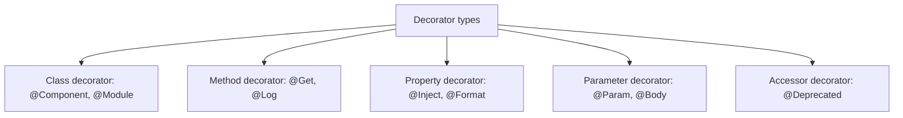
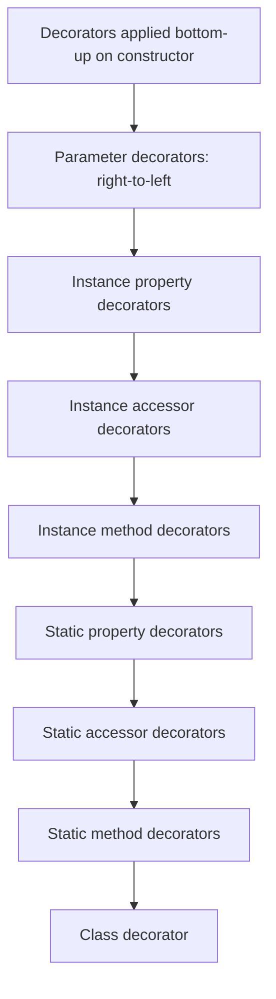

# Decorators

> [!summary] Goal
> Understand TypeScript decorators — both the legacy experimental syntax and the TC39 stage 3 proposal — and how to use them in frameworks like Angular and NestJS.

## Table of Contents

1. [Why Decorators Matter](#why-decorators-matter)
2. [Enabling Decorators](#enabling-decorators)
3. [Decorator Evaluation Order](#decorator-evaluation-order)
4. [Class Decorators](#class-decorators)
5. [Method Decorators](#method-decorators)
6. [Property Decorators](#property-decorators)
7. [Accessor Decorators](#accessor-decorators)
8. [Parameter Decorators](#parameter-decorators)
9. [Decorator Factories](#decorator-factories)
10. [Legacy vs TC39 Decorators](#legacy-vs-tc39-decorators)
11. [Pitfalls](#pitfalls)

---

## Why Decorators Matter

Decorators are a way to add annotations and modify behavior of classes, methods, properties, and parameters. They are heavily used in Angular, NestJS, TypeORM, and many other frameworks.



---

## Enabling Decorators

```json
{
  "compilerOptions": {
    "experimentalDecorators": true,
    "emitDecoratorMetadata": true   // optional — enables design-time type metadata
  }
}
```

> [!warning] Legacy decorators (`experimentalDecorators`) may be deprecated in future TypeScript versions once TC39 decorators stabilize. Check your framework's documentation.

---

## Decorator Evaluation Order



```ts
function first() { console.log('first'); }
function second() { console.log('second'); }

@first
@second
class Example {
  @first @second method() {}
}
// Output: second, first (inner decorator runs first)
```

---

## Class Decorators

A class decorator is applied to the constructor and can modify or replace the class:

```ts
function sealed(constructor: Function) {
  Object.seal(constructor);
  Object.seal(constructor.prototype);
}

@sealed
class Logger {
  log(message: string) {
    console.log(message);
  }
}
```

### Class decorator that returns a subclass

```ts
function withTimestamp<T extends { new (...args: any[]): {} }>(constructor: T) {
  return class extends constructor {
    timestamp = new Date();
  };
}

@withTimestamp
class Report {
  constructor(public title: string) {}
}

const r = new Report('Q1 Results');
// r.timestamp is available — decorator added it
```

---

## Method Decorators

A method decorator can modify the method's behavior:

```ts
function log(target: any, propertyKey: string, descriptor: PropertyDescriptor) {
  const original = descriptor.value;
  descriptor.value = function (...args: any[]) {
    console.log(`Calling ${propertyKey} with`, args);
    const result = original.apply(this, args);
    console.log(`Result:`, result);
    return result;
  };
}

class Calculator {
  @log
  add(a: number, b: number): number {
    return a + b;
  }
}

const calc = new Calculator();
calc.add(2, 3);
// Logs: Calling add with [2, 3]
// Logs: Result: 5
```

### Async method decorator

```ts
function asyncLog(target: any, propertyKey: string, descriptor: PropertyDescriptor) {
  const original = descriptor.value;
  descriptor.value = async function (...args: any[]) {
    const start = Date.now();
    try {
      return await original.apply(this, args);
    } finally {
      console.log(`${propertyKey} took ${Date.now() - start}ms`);
    }
  };
}
```

---

## Property Decorators

Property decorators cannot modify the property value directly — they are used for observation and metadata:

```ts
function format(formatStr: string) {
  return function (target: any, propertyKey: string) {
    let value: string;
    const getter = () => value;
    const setter = (newVal: string) => {
      value = newVal.padStart(formatStr.length, formatStr);
    };
    Object.defineProperty(target, propertyKey, {
      get: getter,
      set: setter,
      enumerable: true,
      configurable: true,
    });
  };
}

class Invoice {
  @format('00000')
  invoiceNumber: string;
}

const inv = new Invoice();
inv.invoiceNumber = '42';
console.log(inv.invoiceNumber);  // '00042'
```

---

## Accessor Decorators

Applied to `get`/`set` accessors, with similar signature to method decorators:

```ts
function deprecated(target: any, propertyKey: string, descriptor: PropertyDescriptor) {
  const original = descriptor.get;
  descriptor.get = function () {
    console.warn(`Property ${propertyKey} is deprecated`);
    return original?.call(this);
  };
}

class Config {
  private _mode = 'dev';

  @deprecated
  get mode() {
    return this._mode;
  }
}
```

---

## Parameter Decorators

Parameter decorators observe that a parameter exists — they cannot modify anything directly:

```ts
import 'reflect-metadata';

function inject(serviceIdentifier: string) {
  return function (target: Object, propertyKey: string | symbol, parameterIndex: number) {
    const existingParams = Reflect.getOwnMetadata('inject:params', target, propertyKey) || [];
    existingParams.push({ index: parameterIndex, service: serviceIdentifier });
    Reflect.defineMetadata('inject:params', existingParams, target, propertyKey);
  };
}

class UserService {
  constructor(@inject('Logger') private logger: Logger) {}
}
```

---

## Decorator Factories

A decorator factory returns a decorator function, allowing configuration:

```ts
function log(level: 'info' | 'warn' | 'error') {
  return function (target: any, propertyKey: string, descriptor: PropertyDescriptor) {
    const original = descriptor.value;
    descriptor.value = function (...args: any[]) {
      console[level](`[${level.toUpperCase()}] ${propertyKey}:`, ...args);
      return original.apply(this, args);
    };
  };
}

class Service {
  @log('info')
  process(data: string) { return data.toUpperCase(); }

  @log('error')
  fail(message: string) { throw new Error(message); }
}
```

---

## Legacy vs TC39 Decorators

| Feature | Legacy (`experimentalDecorators`) | TC39 Stage 3 |
|---------|----------------------------------|--------------|
| Syntax | `@decorator` on class members | `@decorator` on class members |
| TypeScript flag | `experimentalDecorators: true` | No flag needed (TS 5.0+) |
| Class decorator return | Constructor function | `(value: Class, ctx: ClassDecoratorContext) => Class` |
| Method decorator | `(target, key, desc)` | `(fn: Function, ctx: MethodDecoratorContext) => Function` |
| Metadata support | `reflect-metadata` + `emitDecoratorMetadata` | Separate proposal (not yet standardized) |
| Framework support | Angular, NestJS, TypeORM, class-validator | Not yet widely adopted |

### TC39 example

```ts
function logged<T extends (...args: any[]) => any>(
  fn: T,
  context: ClassMethodDecoratorContext
): T {
  return function (this: any, ...args: Parameters<T>): ReturnType<T> {
    console.log(`Calling ${String(context.name)}`);
    return fn.apply(this, args);
  } as T;
}

class MyClass {
  @logged
  greet(name: string) {
    return `Hello, ${name}`;
  }
}
```

---

## Pitfalls

### Decorators are not type transformations

Decorators operate at runtime. They cannot change the compile-time type of what they decorate:

```ts
function makeReadOnly(target: any, key: string) {
  Object.defineProperty(target, key, { writable: false });
}

class Foo {
  @makeReadOnly
  bar = 'original';
}

const f = new Foo();
f.bar = 'changed';              // No compile-time error!
console.log(f.bar);             // 'original' — but TS doesn't know it's readonly
```

### Forgetting `reflect-metadata` import

```ts
// BAD: Reflect is undefined at runtime
class Service {
  constructor(@inject('Logger') logger: Logger) {}
}
```

**Fix**: `import 'reflect-metadata'` at your application entry point.

### Decorator order dependence

Multiple decorators on the same target are evaluated bottom-up but applied top-down:

```ts
@first
@second
class MyClass {}
// second's inner function runs first, then first's inner function
```

---

> [!question]- Interview Questions
>
> **Q: What are the types of decorators in TypeScript?**
> A: Class, method, property, accessor, and parameter decorators. Each receives different arguments (target, property key, descriptor).
>
> **Q: What is the difference between legacy and TC39 decorators?**
> A: Legacy decorators use `experimentalDecorators: true` and take `(target, key, descriptor)`. TC39 decorators use no flag and take `(fn, context)`. TC39 lacks metadata support but is the future standard.
>
> **Q: Can a decorator change the type of what it decorates?**
> A: No. Decorators run at runtime and cannot change compile-time types. You'd need a helper type or a transformer plugin for compile-time type changes.
>
> **Q: What is the evaluation order of multiple decorators?**
> A: Inner decorators run first (bottom-up). For a class `@A @B Class`, `B`'s decorator runs its inner function first, then `A`.

---

## Cross-Links

- [[TypeScript/02_Core/05_Classes_and_OOP]] for class syntax used with decorators
- [[TypeScript/01_Foundations/05_TS_Config_and_Compiler]] for `experimentalDecorators` flag
- [[Angular/00_MOC/00_Angular_MOC]] for framework decorator usage

---

## References

- [TypeScript Decorators](https://www.typescriptlang.org/docs/handbook/decorators.html)
- [TC39 Decorators Proposal](https://github.com/tc39/proposal-decorators)
- [reflect-metadata](https://rbuckton.github.io/reflect-metadata/)
- [NestJS Decorators](https://docs.nestjs.com/custom-decorators)
