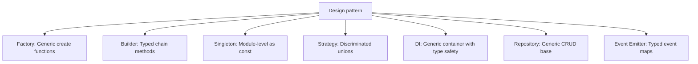

# Design Patterns in TypeScript

> [!summary] Goal
> Implement classic design patterns leveraging TypeScript's type system for safer, more expressive code: factory, builder, singleton, strategy, dependency injection, and event emitter.

## Table of Contents

1. [Why Design Patterns with TypeScript](#why-design-patterns-with-typescript)
2. [Factory Pattern](#factory-pattern)
3. [Builder Pattern](#builder-pattern)
4. [Singleton Pattern](#singleton-pattern)
5. [Strategy Pattern (with Discriminated Unions)](#strategy-pattern)
6. [Dependency Injection](#dependency-injection)
7. [Repository Pattern](#repository-pattern)
8. [Event Emitter (Typed)](#event-emitter)
9. [Pitfalls](#pitfalls)

---

## Why Design Patterns with TypeScript

TypeScript's generics, unions, and structural typing make classic design patterns safer and more concise:



---

## Factory Pattern

### Simple factory with discriminated union

```ts
type ShapeKind = 'circle' | 'rectangle' | 'triangle';

interface Circle { kind: 'circle'; radius: number; }
interface Rectangle { kind: 'rectangle'; width: number; height: number; }
interface Triangle { kind: 'triangle'; base: number; height: number; }

type Shape = Circle | Rectangle | Triangle;

interface ShapeFactory {
  createCircle(radius: number): Circle;
  createRectangle(width: number, height: number): Rectangle;
  createTriangle(base: number, height: number): Triangle;
}

const shapeFactory: ShapeFactory = {
  createCircle: (radius) => ({ kind: 'circle', radius }),
  createRectangle: (width, height) => ({ kind: 'rectangle', width, height }),
  createTriangle: (base, height) => ({ kind: 'triangle', base, height }),
};
```

### Generic factory

```ts
interface Constructor<T> {
  new (...args: any[]): T;
}

function createInstance<T>(
  ctor: Constructor<T>,
  ...args: any[]
): T {
  return new ctor(...args);
}

class User { constructor(public name: string) {} }
const user = createInstance(User, 'Alice');  // typed as User
```

### Registry pattern

```ts
type FileHandler = (file: string) => Promise<void>;

const handlers = new Map<string, FileHandler>();

function register(extension: string, handler: FileHandler): void {
  handlers.set(extension, handler);
}

function processFile(filename: string): Promise<void> {
  const ext = filename.split('.').pop() ?? '';
  const handler = handlers.get(ext);
  if (!handler) throw new Error(`No handler for .${ext}`);
  return handler(filename);
}
```

---

## Builder Pattern

### Typed builder with generics

```ts
class UserBuilder {
  private _name: string = '';
  private _email: string = '';
  private _role: 'admin' | 'user' = 'user';

  setName(name: string): this {
    this._name = name;
    return this;
  }

  setEmail(email: string): this {
    this._email = email;
    return this;
  }

  setRole(role: 'admin' | 'user'): this {
    this._role = role;
    return this;
  }

  build(): { name: string; email: string; role: string } {
    return {
      name: this._name,
      email: this._email,
      role: this._role,
    };
  }
}

const user = new UserBuilder()
  .setName('Alice')
  .setEmail('alice@example.com')
  .setRole('admin')
  .build();
```

### Fluent builder with required steps (compile-time safety)

```ts
class QueryBuilder {
  private conditions: string[] = [];
  private orderByField?: string;

  private constructor() {}

  static create(): QueryBuilder {
    return new QueryBuilder();
  }

  where(field: string, op: string, value: unknown): this {
    this.conditions.push(`${field} ${op} ${value}`);
    return this;
  }

  orderBy(field: string): this {
    this.orderByField = field;
    return this;
  }

  build(): string {
    let query = 'SELECT * FROM items';
    if (this.conditions.length > 0) {
      query += ` WHERE ${this.conditions.join(' AND ')}`;
    }
    if (this.orderByField) {
      query += ` ORDER BY ${this.orderByField}`;
    }
    return query;
  }
}

const query = QueryBuilder.create()
  .where('age', '>', 18)
  .where('status', '=', 'active')
  .orderBy('name')
  .build();
```

---

## Singleton Pattern

### Module-level singleton (recommended)

```ts
// config.ts
export const config = {
  apiUrl: process.env.API_URL ?? 'http://localhost:3000',
  debug: process.env.DEBUG === 'true',
} as const;

type Config = typeof config;
// Using `as const` gives literal types
```

### Class-based singleton

```ts
class DatabaseConnection {
  private static instance: DatabaseConnection;

  private constructor() {
    // Private constructor prevents direct instantiation
  }

  static getInstance(): DatabaseConnection {
    if (!DatabaseConnection.instance) {
      DatabaseConnection.instance = new DatabaseConnection();
    }
    return DatabaseConnection.instance;
  }

  query(sql: string): unknown[] {
    return [];
  }
}

const db = DatabaseConnection.getInstance();
```

---

## Strategy Pattern (with Discriminated Unions)

Instead of the OOP strategy pattern, TypeScript can use discriminated unions:

```ts
// Strategy as a union of functions
type SortStrategy =
  | { kind: 'bubble' }
  | { kind: 'quick' }
  | { kind: 'merge' }
  | { kind: 'custom'; comparator: (a: number, b: number) => number };

function sort(data: number[], strategy: SortStrategy): number[] {
  switch (strategy.kind) {
    case 'bubble': return bubbleSort(data);
    case 'quick': return quickSort(data);
    case 'merge': return mergeSort(data);
    case 'custom': return data.sort(strategy.comparator);
  }
}

// Usage — switch exhaustiveness ensures all strategies handled
```

### Configurable strategy object

```ts
interface PaymentStrategy {
  pay(amount: number): Promise<PaymentResult>;
}

class CreditCardStrategy implements PaymentStrategy {
  constructor(private cardNumber: string, private cvv: string) {}
  async pay(amount: number): Promise<PaymentResult> {
    // Process credit card payment
    return { success: true, transactionId: 'cc_' + Date.now() };
  }
}

class PayPalStrategy implements PaymentStrategy {
  constructor(private email: string) {}
  async pay(amount: number): Promise<PaymentResult> {
    // Process PayPal payment
    return { success: true, transactionId: 'pp_' + Date.now() };
  }
}

type PaymentResult = { success: true; transactionId: string } | { success: false; error: string };

async function checkout(amount: number, strategy: PaymentStrategy) {
  return strategy.pay(amount);
}
```

---

## Dependency Injection

### Typed DI container

```ts
type ServiceToken<T> = string & { __brand: T };

class Container {
  private services = new Map<string, { factory: () => unknown; singleton: boolean; instance?: unknown }>();

  register<T>(token: ServiceToken<T>, factory: () => T, singleton = true): void {
    this.services.set(token, { factory, singleton });
  }

  resolve<T>(token: ServiceToken<T>): T {
    const entry = this.services.get(token);
    if (!entry) throw new Error(`Service not registered: ${token}`);

    if (entry.singleton) {
      if (!entry.instance) {
        entry.instance = entry.factory();
      }
      return entry.instance as T;
    }
    return entry.factory() as T;
  }
}

// Type-safe tokens
const TOKENS = {
  Logger: 'Logger' as ServiceToken<Logger>,
  Config: 'Config' as ServiceToken<Config>,
  UserService: 'UserService' as ServiceToken<UserService>,
};

const container = new Container();
container.register(TOKENS.Logger, () => new ConsoleLogger());
container.register(TOKENS.Config, () => ({ apiUrl: 'http://localhost:3000' }));
container.register(TOKENS.UserService, () => new UserService(
  container.resolve(TOKENS.Logger),
  container.resolve(TOKENS.Config),
));

const service = container.resolve(TOKENS.UserService);
```

---

## Repository Pattern

### Generic CRUD repository

```ts
interface Entity {
  id: string;
}

interface Repository<T extends Entity> {
  findById(id: string): Promise<T | null>;
  findAll(): Promise<T[]>;
  create(data: Omit<T, 'id'>): Promise<T>;
  update(id: string, data: Partial<T>): Promise<T>;
  delete(id: string): Promise<void>;
}

class InMemoryRepository<T extends Entity> implements Repository<T> {
  private items = new Map<string, T>();

  async findById(id: string): Promise<T | null> {
    return this.items.get(id) ?? null;
  }

  async findAll(): Promise<T[]> {
    return Array.from(this.items.values());
  }

  async create(data: Omit<T, 'id'>): Promise<T> {
    const id = crypto.randomUUID();
    const item = { ...data, id } as T;
    this.items.set(id, item);
    return item;
  }

  async update(id: string, data: Partial<T>): Promise<T> {
    const existing = this.items.get(id);
    if (!existing) throw new Error(`Item ${id} not found`);
    const updated = { ...existing, ...data };
    this.items.set(id, updated);
    return updated;
  }

  async delete(id: string): Promise<void> {
    this.items.delete(id);
  }
}
```

---

## Event Emitter (Typed)

```ts
type EventMap = {
  'user:created': { userId: string; email: string };
  'user:updated': { userId: string; changes: string[] };
  'order:placed': { orderId: string; total: number };
  'error': { message: string; code?: number };
};

class TypedEventEmitter<T extends Record<string, unknown>> {
  private listeners = new Map<keyof T, Set<(data: T[keyof T]) => void>>();

  on<K extends keyof T>(event: K, handler: (data: T[K]) => void): void {
    if (!this.listeners.has(event)) {
      this.listeners.set(event, new Set());
    }
    this.listeners.get(event)!.add(handler as (data: T[keyof T]) => void);
  }

  emit<K extends keyof T>(event: K, data: T[K]): void {
    this.listeners.get(event)?.forEach(handler => handler(data));
  }

  off<K extends keyof T>(event: K, handler: (data: T[K]) => void): void {
    this.listeners.get(event)?.delete(handler as (data: T[keyof T]) => void);
  }
}

const emitter = new TypedEventEmitter<EventMap>();

emitter.on('user:created', (data) => {
  console.log(data.userId);  // typed as string
  console.log(data.email);   // typed as string
});

emitter.emit('user:created', { userId: '123', email: 'a@b.com' });
```

---

## Pitfalls

### Over-engineering with patterns

```ts
// BAD: unnecessary abstraction for simple cases
const getConfig = () => ({ debug: true });  // simpler than a singleton class
```

**Fix**: Prefer functions and module-level values over class-based patterns unless you need state or polymorphism.

### `this` loss in method extraction

```ts
class Builder {
  value = 0;
  add(n: number): this { this.value += n; return this; }
}

const builder = new Builder();
const { add } = builder;  // `this` is undefined when called without context
```

**Fix**: Use arrow functions for methods that are extracted, or `.bind(this)`.

### Singleton testability

Singletons make unit testing difficult because state persists across tests.

**Fix**: Use dependency injection so singletons can be replaced with mocks.

---

> [!question]- Interview Questions
>
> **Q: How does TypeScript improve the factory pattern?**
> A: Generics allow type-safe factory functions that return correctly typed instances without casting. Discriminated unions can model product families with compile-time exhaustiveness.
>
> **Q: What is the recommended singleton approach in TypeScript?**
> A: Module-level values (`export const x = ...`). They are natively singleton in ES modules, simpler than class-based singletons, and work with `as const` for literal types.
>
> **Q: How do discriminated unions implement the strategy pattern?**
> A: A union type represents all strategy options, and a switch/match on the `kind` discriminant provides exhaustiveness checking — the compiler ensures all strategies are handled.
>
> **Q: How do you type an event emitter in TypeScript?**
> A: Define an event map type where each key is an event name and each value is the payload type. Use generics with a constraint on the map keys to type the `emit` and `on` methods.

---

## Cross-Links

- [[TypeScript/02_Core/03_Discriminated_Unions]] for strategy pattern union types
- [[TypeScript/02_Core/05_Classes_and_OOP]] for class-based patterns
- [[TypeScript/03_Advanced/04_Typing_Patterns_for_APIs]] for API-level patterns

---

## References

- [TypeScript Patterns](https://www.typescriptlang.org/play#example/typescript-patterns)
- [Refactoring Guru: TypeScript Design Patterns](https://refactoring.guru/design-patterns/typescript)
- [TypeScript Deep Dive: Patterns](https://basarat.gitbook.io/typescript/main-1/factory-pattern)
