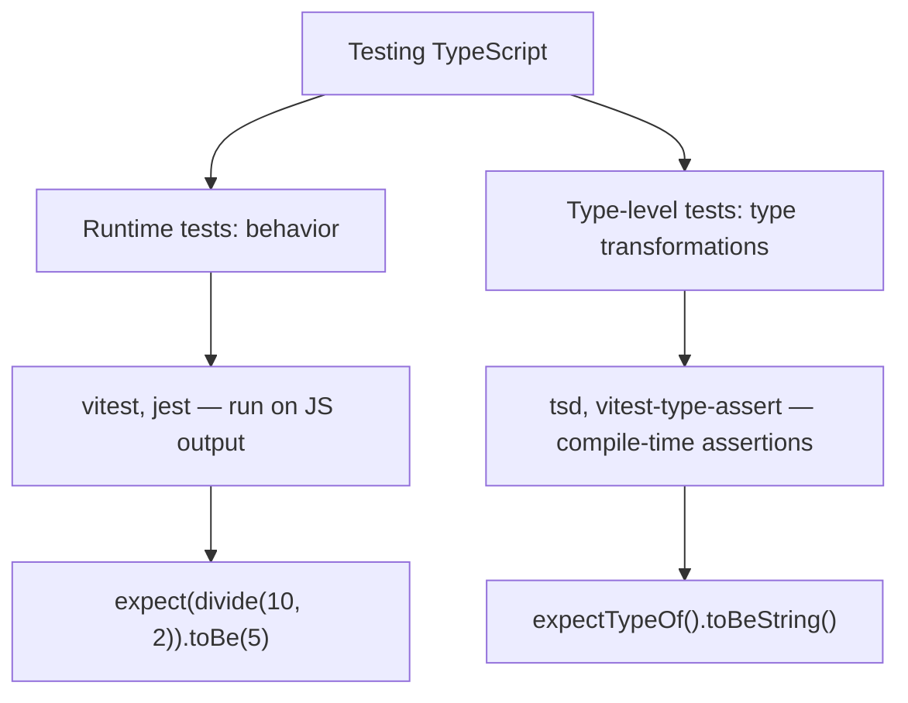

# Playbook: Testing TypeScript Code

> [!summary] Goal
> Test TypeScript code effectively: unit tests with Vitest/Jest, type-level tests with `tsd`, and strategies for testing typed code without excessive mock overhead.

## Table of Contents

1. [Why Testing TypeScript Is Different](#why-testing-typescript-is-different)
2. [Vitest Setup for TypeScript](#vitest-setup-for-typescript)
3. [Testing Typed Functions](#testing-typed-functions)
4. [Type-Level Testing](#type-level-testing)
5. [Testing Async Code](#testing-async-code)
6. [DTS Testing with `tsd`](#dts-testing-with-tsd)
7. [Testing Strategies](#testing-strategies)
8. [Pitfalls](#pitfalls)

---

## Why Testing TypeScript Is Different

TypeScript provides compile-time type checking, but runtime behavior must still be tested. You need both:



---

## Vitest Setup for TypeScript

```bash
npm install -D vitest
```

```ts
// vitest.config.ts
import { defineConfig } from 'vitest/config';

export default defineConfig({
  test: {
    globals: true,
    environment: 'node',
    include: ['src/**/*.test.ts'],
  },
});
```

```json
// package.json
{
  "scripts": {
    "test": "vitest",
    "test:coverage": "vitest --coverage"
  }
}
```

---

## Testing Typed Functions

```ts
// math.ts
export function divide(a: number, b: number): number {
  if (b === 0) throw new Error('Division by zero');
  return a / b;
}
```

```ts
// math.test.ts
import { describe, it, expect } from 'vitest';
import { divide } from './math';

describe('divide', () => {
  it('divides positive numbers correctly', () => {
    expect(divide(10, 2)).toBe(5);
  });

  it('handles negative numbers', () => {
    expect(divide(-10, 2)).toBe(-5);
  });

  it('throws on division by zero', () => {
    expect(() => divide(10, 0)).toThrow('Division by zero');
  });

  it('returns a number', () => {
    const result = divide(4, 2);
    // TypeScript already ensures `result` is `number`
    // But we can still assert at runtime:
    expect(typeof result).toBe('number');
  });
});
```

### Testing generic functions

```ts
export function first<T>(items: T[]): T | undefined {
  return items[0];
}

describe('first', () => {
  it('returns the first element', () => {
    const result = first([1, 2, 3]);
    expect(result).toBe(1);
    // result is inferred as number | undefined
  });

  it('returns undefined for empty array', () => {
    expect(first([])).toBeUndefined();
  });

  it('works with strings', () => {
    const result = first(['a', 'b', 'c']);
    expect(result).toBe('a');
    // result is inferred as string | undefined
  });
});
```

---

## Type-Level Testing

### `vitest-type-assert`

```bash
npm install -D vitest-type-assert
```

```ts
import { assertType, isExactType } from 'vitest-type-assert';

import { first } from './math';

it('first returns the correct type', () => {
  const result = first([1, 2, 3]);
  assertType<number | undefined>(result);  // passes
});

it('type is exactly number | undefined', () => {
  const result = first([1, 2, 3]);
  isExactType<number | undefined>(result);  // passes — not wider
});
```

### `@ts-expect-error` in tests

```ts
import { divide } from './math';

it('divide rejects string arguments at compile time', () => {
  // @ts-expect-error — passing string should be a compile error
  divide('10' as any, 2);
});
```

---

## Testing Async Code

```ts
export async function fetchUser(id: string): Promise<{ name: string }> {
  const res = await fetch(`/users/${id}`);
  if (!res.ok) throw new Error(`HTTP ${res.status}`);
  return res.json();
}
```

```ts
import { describe, it, expect, vi } from 'vitest';
import { fetchUser } from './api';

describe('fetchUser', () => {
  it('returns user data on success', async () => {
    const mockUser = { name: 'Alice' };
    global.fetch = vi.fn().mockResolvedValue({
      ok: true,
      json: () => Promise.resolve(mockUser),
    });

    const result = await fetchUser('123');
    expect(result).toEqual(mockUser);
  });

  it('throws on HTTP error', async () => {
    global.fetch = vi.fn().mockResolvedValue({
      ok: false,
      status: 404,
    });

    await expect(fetchUser('999')).rejects.toThrow('HTTP 404');
  });
});
```

---

## DTS Testing with `tsd`

For libraries with public `.d.ts` files, `tsd` verifies that your types work correctly:

```bash
npm install -D tsd
```

```ts
// index.test-d.ts
import { expectType, expectError, expectAssignable } from 'tsd';
import { divide, first } from '../src';

expectType<number>(divide(10, 2));
expectError(divide(10, '2' as any));  // should not compile

expectType<number | undefined>(first([1, 2]));
expectType<string | undefined>(first(['a', 'b']));
expectAssignable<number[]>(first([[1, 2]]));  // first returns number[] | undefined

// Test branded types
expectType<string>(divide.name);  // functions have properties
```

### Running tsd

```json
{
  "scripts": {
    "test:types": "tsd"
  }
}
```

---

## Testing Strategies

### Testing discriminated unions

```ts
type Result<T> =
  | { ok: true; data: T }
  | { ok: false; error: string };

function parseJson(s: string): Result<unknown> {
  try {
    const data = JSON.parse(s);
    return { ok: true, data };
  } catch {
    return { ok: false, error: 'Invalid JSON' };
  }
}

describe('parseJson', () => {
  it('returns success with data', () => {
    const result = parseJson('{"a":1}');
    expect(result.ok).toBe(true);
    if (result.ok) {
      expect(result.data).toEqual({ a: 1 });
    }
  });

  it('returns error for invalid JSON', () => {
    const result = parseJson('not json');
    expect(result.ok).toBe(false);
    if (!result.ok) {
      expect(result.error).toBe('Invalid JSON');
    }
  });
});
```

### Testing type guards

```ts
function isString(value: unknown): value is string {
  return typeof value === 'string';
}

describe('isString', () => {
  it('returns true for strings', () => {
    expect(isString('hello')).toBe(true);
  });

  it('returns false for non-strings', () => {
    expect(isString(42)).toBe(false);
    expect(isString(null)).toBe(false);
    expect(isString(undefined)).toBe(false);
    expect(isString({})).toBe(false);
  });
});
```

---

## Pitfalls

### Testing the type system instead of behavior

```ts
// BAD — only tests the compiler, not runtime
it('returns number', () => {
  const result = add(1, 2);
  expect(typeof result).toBe('number');  // Typescript already checks this
});

// BETTER — tests actual behavior
it('adds numbers correctly', () => {
  expect(add(1, 2)).toBe(3);
  expect(add(-1, 1)).toBe(0);
});
```

### False positives with `any`

```ts
const result: any = someFunction();
expect(result.someProperty).toBe(42);  // No error — but `any` bypasses all checks
```

**Fix**: Avoid `any` in test assertions. Use the concrete type.

### Over-mocking

Mocking every dependency leads to brittle tests. Prefer integration tests with real types and mock only at system boundaries (network, file system, database).

### Type-level tests don't catch runtime bugs

```ts
expectType<number>(divide(10, 2));  // passes at compile time
// But runtime: divide(10, 0) still throws — type-level test didn't catch it
```

**Fix**: Write both type-level and runtime tests.

---

> [!question]- Interview Questions
>
> **Q: What is the difference between runtime testing and type-level testing?**
> A: Runtime tests (vitest/jest) run the compiled JavaScript and verify behavior. Type-level tests (tsd, expectTypeOf) run at compile time to verify type transformations work correctly.
>
> **Q: How do you test a generic function's type inference?**
> A: Call the function with different argument types and use `expectTypeOf` or `assertType` to verify the inferred return type matches expectations.
>
> **Q: What is `tsd` used for?**
> A: `tsd` is a CLI tool that runs type tests written in `.test-d.ts` files, verifying that public API types produce expected errors and type assignments.
>
> **Q: How do you test a discriminated union exhaustively?**
> A: Write a test that calls the function with each variant and verifies the narrowing behavior. The compiler ensures all cases are handled if you use switch exhaustiveness.

---

## Cross-Links

- [[TypeScript/02_Core/08_Async_TypeScript]] for testing async functions
- [[TypeScript/01_Foundations/04_Narrowing_and_Type_Guards]] for type guard testing patterns
- [[TypeScript/04_Playbooks/04_Linting_and_Formatting]] for ESLint test rules

---

## References

- [Vitest](https://vitest.dev/)
- [tsd](https://github.com/SamVerschueren/tsd)
- [TypeScript Testing Patterns](https://www.typescriptlang.org/docs/handbook/testing.html)
- [Vitest Type Assertions](https://vitest.dev/guide/testing-types.html)
