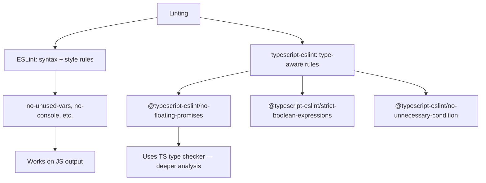
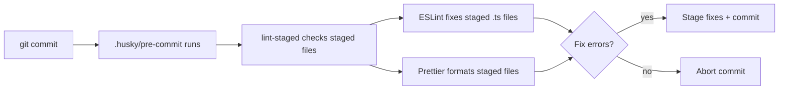

# Playbook: Linting and Formatting

> [!summary] Goal
> Set up ESLint with `typescript-eslint` and Prettier for consistent, error-free TypeScript code, integrated with pre-commit hooks and CI.

## Table of Contents

1. [Why Linting TypeScript Is Different](#why-linting-typescript-is-different)
2. [ESLint + `typescript-eslint` Setup](#eslint-typescript-eslint-setup)
3. [Recommended Rule Sets](#recommended-rule-sets)
4. [Prettier Integration](#prettier-integration)
5. [Pre-Commit Hooks with Husky](#pre-commit-hooks-with-husky)
6. [CI Integration](#ci-integration)
7. [Pitfalls](#pitfalls)

---

## Why Linting TypeScript Is Different

TypeScript linting needs rules that understand the type system — not just syntax:



> [!tip] Definition
> **`typescript-eslint`**: the toolchain that enables ESLint to parse TypeScript syntax and use the TypeScript type checker for advanced lint rules.

---

## ESLint + `typescript-eslint` Setup

```bash
npm install -D eslint @eslint/js typescript-eslint
```

```ts
// eslint.config.js (flat config — ESLint 9+)
import eslint from '@eslint/js';
import tseslint from 'typescript-eslint';

export default tseslint.config(
  eslint.configs.recommended,
  ...tseslint.configs.recommended,
  ...tseslint.configs.strictTypeChecked,
  {
    languageOptions: {
      parserOptions: {
        projectService: true,
        tsconfigRootDir: import.meta.dirname,
      },
    },
    rules: {
      '@typescript-eslint/no-unused-vars': ['error', { argsIgnorePattern: '^_' }],
      '@typescript-eslint/no-floating-promises': 'error',
      '@typescript-eslint/prefer-nullish-coalescing': 'error',
      '@typescript-eslint/no-explicit-any': 'warn',
    },
  },
  {
    ignores: ['dist/', 'node_modules/', '*.config.*'],
  }
);
```

```json
// package.json
{
  "scripts": {
    "lint": "eslint .",
    "lint:fix": "eslint . --fix"
  }
}
```

---

## Recommended Rule Sets

`typescript-eslint` provides several config levels:

| Config | Focus | Rules count | When to use |
|--------|-------|-------------|-------------|
| `recommended` | Common correctness | ~50 | All projects |
| `recommended-type-checked` | `recommended` + type-aware | ~80 | Projects with strict mode |
| `strict-type-checked` | Maximum safety | ~120 | Critical libraries |
| `stylistic-type-checked` | Code style | ~40 | Style preferences |

### Key type-aware rules

```ts
// @typescript-eslint/no-floating-promises
// BAD: promise not awaited
async function run() {
  fetchData();  // Error: Promise returned — did you forget to await?
}

// @typescript-eslint/no-unnecessary-condition
// BAD: always true
function process(x: string) {
  if (x) { /* always true for strings */ }
}

// @typescript-eslint/prefer-nullish-coalescing
// BETTER: ?? instead of ||
const value = input ?? defaultValue;  // only catches null/undefined
// VS: input || defaultValue  — catches all falsy values
```

---

## Prettier Integration

```bash
npm install -D prettier eslint-config-prettier
```

```ts
// eslint.config.js
import eslint from '@eslint/js';
import tseslint from 'typescript-eslint';
import eslintConfigPrettier from 'eslint-config-prettier';

export default tseslint.config(
  eslint.configs.recommended,
  ...tseslint.configs.recommended,
  eslintConfigPrettier,  // must be last — disables conflicting rules
);
```

```json
// .prettierrc
{
  "semi": true,
  "singleQuote": true,
  "trailingComma": "all",
  "printWidth": 100,
  "tabWidth": 2
}
```

```json
{
  "scripts": {
    "format": "prettier --write .",
    "format:check": "prettier --check ."
  }
}
```

---

## Pre-Commit Hooks with Husky

```bash
npm install -D husky lint-staged
npx husky init
```

```json
// package.json
{
  "lint-staged": {
    "*.ts": ["eslint --fix", "prettier --write"],
    "*.json": ["prettier --write"]
  }
}
```

```bash
# .husky/pre-commit
npx lint-staged
```



---

## CI Integration

```yaml
# .github/workflows/ci.yml
name: CI
on: [push, pull_request]

jobs:
  lint:
    runs-on: ubuntu-latest
    steps:
      - uses: actions/checkout@v4
      - uses: actions/setup-node@v4
        with:
          node-version: 20
      - run: npm ci
      - run: npm run lint
      - run: npm run format:check
```

---

## Pitfalls

### Type-aware linting is slow

`parserOptions.project` causes ESLint to type-check the project, which is significantly slower than syntax-only linting.

**Fix**: Use type-aware linting on pre-commit only (via `lint-staged`), and syntax-only linting in CI.

### Configuring flat config vs legacy `.eslintrc`

| Aspect | Legacy `.eslintrc` | Flat config (ESLint 9+) |
|--------|-------------------|------------------------|
| Format | JSON/YAML/JS | `eslint.config.js` (ES export) |
| Parser config | `parser: '@typescript-eslint/parser'` | Included in `tseslint.config()` |
| Extends | `extends: ['plugin:@typescript-eslint/recommended']` | Spread `...tseslint.configs.recommended` |
| Type-aware | `parserOptions.project: true` | `parserOptions.projectService: true` |

### Missing `eslint-config-prettier`

Without it, ESLint's formatting rules conflict with Prettier's output — you get "expected indentation" errors on correctly formatted code.

### ESLint ignoring type errors

```ts
// BAD: ESLint won't catch this — it's a TS compiler error, not a lint error
const x: string = 42;  // TypeScript error: Type 'number' is not assignable to type 'string'
```

**Fix**: Run `tsc --noEmit` in CI alongside the linter. Lint catches style/patterns, tsc catches actual type errors.

---

> [!question]- Interview Questions
>
> **Q: What is the difference between `typescript-eslint`'s `recommended` and `recommended-type-checked` configs?**
> A: `recommended` uses only syntax rules. `recommended-type-checked` adds rules that require the TypeScript type checker, catching deeper issues like floating promises and unnecessary conditions.
>
> **Q: How does Prettier integrate with ESLint?**
> A: `eslint-config-prettier` disables all ESLint rules that would conflict with Prettier. Run Prettier first (formatting), then ESLint (code quality) — or use `eslint --fix` with the compatibility config.
>
> **Q: What is `lint-staged` used for?**
> A: It runs linters only on staged (changed) files, not the entire project. This makes pre-commit hooks fast even in large codebases.
>
> **Q: Why might type-aware linting be slow and how do you mitigate it?**
> A: Type-aware linting runs the TypeScript type checker under the hood, which can take seconds. Mitigate by running it only on pre-commit with `lint-staged`, and using syntax-only linting in CI.

---

## Cross-Links

- [[TypeScript/01_Foundations/05_TS_Config_and_Compiler]] for tsconfig flags that affect linting
- [[TypeScript/04_Playbooks/03_Testing_TypeScript]] for running lint + test in CI
- [[TypeScript/04_Playbooks/05_Migrating_JS_to_TS]] for lint rules during migration

---

## References

- [typescript-eslint](https://typescript-eslint.io/)
- [Prettier](https://prettier.io/)
- [Husky](https://typicode.github.io/husky/)
- [lint-staged](https://github.com/lint-staged/lint-staged)
