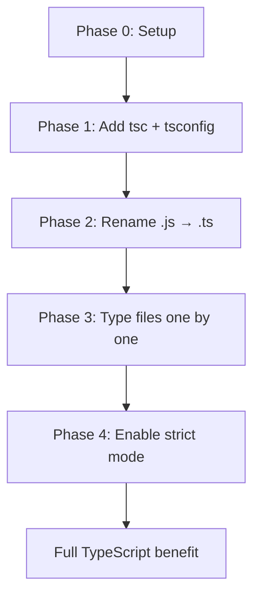

# Playbook: Migrating JavaScript to TypeScript

> [!summary] Goal
> Convert a JavaScript codebase to TypeScript incrementally, without stopping delivery. Add types file-by-file, use existing JS dependencies, and adopt strict mode gradually.

## Table of Contents

1. [Why Migrate Incrementally](#why-migrate-incrementally)
2. [Phase 0: Project Setup](#phase-0-project-setup)
3. [Phase 1: Add TypeScript Compiler](#phase-1-add-typescript-compiler)
4. [Phase 2: Rename Files to `.ts`](#phase-2-rename-files-to-ts)
5. [Phase 3: Incremental Typing](#phase-3-incremental-typing)
6. [Phase 4: Enable Strict Mode](#phase-4-enable-strict-mode)
7. [Tools and Patterns](#tools-and-patterns)
8. [Pitfalls](#pitfalls)

---

## Why Migrate Incrementally

A full rewrite in TypeScript is risky and slow. Incremental migration lets you get value from each step.



---

## Phase 0: Project Setup

```bash
npm install -D typescript @types/node
npx tsc --init
```

```json
{
  "compilerOptions": {
    "target": "ES2022",
    "module": "Node16",
    "moduleResolution": "Node16",
    "allowJs": true,
    "checkJs": false,
    "outDir": "dist",
    "rootDir": "src",
    "strict": false,
    "noEmit": true,
    "skipLibCheck": true
  },
  "include": ["src"]
}
```

> [!tip] `allowJs: true` let's you have `.ts` and `.js` files side by side. TypeScript will type-check the `.ts` files and pass `.js` files through untouched.

---

## Phase 1: Add TypeScript Compiler

```json
// package.json
{
  "scripts": {
    "type-check": "tsc --noEmit",
    "build": "tsc"
  }
}
```

At this point:
- All `.ts` files get type-checked
- `.js` files are included but not checked (`checkJs: false`)
- The project still runs as JS in development

---

## Phase 2: Rename Files to `.ts`

Rename files one at a time, fixing only the most obvious errors:

```bash
mv src/utils.js src/utils.ts
```

### Use `@ts-expect-error` for unfixable lines

```ts
// @ts-expect-error — this JS lib uses dynamic properties
legacyApi.doSomething(data);
```

### Use loose types at module boundaries

```ts
// Prefer these during migration:
function process(data: any): any {
  return data.map((x: any) => x.value);
}
```

### Migration annotations

| Annotation | Purpose |
|------------|---------|
| `@ts-expect-error` | Suppress error on the **next line** — error if no error exists |
| `@ts-ignore` (avoid) | Suppress error on the next line — silent if no error |
| `@ts-nocheck` | Skip type-checking the entire file |
| `@ts-check` | Enable type-checking for a `.js` file |

---

## Phase 3: Incremental Typing

### Add types to one module at a time

```ts
// Start with loose types, tighten later:
export function fetchData(url: string): Promise<any> {
  return fetch(url).then(r => r.json());
}
```

### Use `checkJs: true` for gradual JS checking

```ts
// @ts-check — add to individual .js files
// This catches basic issues without renaming to .ts
```

### Add `@types` packages

```bash
npm install -D @types/express @types/lodash @types/react
```

### Write declaration files for JS-only dependencies

```ts
// types/untyped-lib.d.ts
declare module 'untyped-lib' {
  export function doThing(): void;
  export const VERSION: string;
}
```

### Migrate order (lowest risk first)

1. **Utility functions** — pure, no side effects
2. **Types/interfaces** — no runtime impact
3. **Exported functions** — affects callers
4. **Classes** — may need constructor changes
5. **React components** — requires JSX handling
6. **Entry points** — last, ties everything together

---

## Phase 4: Enable Strict Mode

Once most files are typed, enable strict mode flags one at a time:

```json
{
  "compilerOptions": {
    "strict": true
    // Or enable flags individually:
    // "noImplicitAny": true,
    // "strictNullChecks": true,
    // "strictFunctionTypes": true,
    // "noUncheckedIndexedAccess": true,
  }
}
```

### Strict null checks migration

```ts
// Before strictNullChecks:
function getName(user: User) {
  return user.name;  // assumed string, could be null
}

// After:
function getName(user: User): string {
  return user.name ?? '';  // must handle null/undefined
}
```

---

## Tools and Patterns

### `npx ts-migrate` (Airbnb)

Automated migration tool that adds `any` types and `@ts-expect-error` annotations:

```bash
npx ts-migrate rename src/ --sources src/
npx ts-migrate migrate src/
```

### `eslint` migration rules

```json
{
  "rules": {
    "@typescript-eslint/no-explicit-any": "off",  // allow during migration
    "@typescript-eslint/explicit-function-return-type": "off"
  }
}
```

### Migration checklist

- [ ] `npm install -D typescript @types/node`
- [ ] `tsc --init` with `allowJs: true`
- [ ] Rename `index.js` to `index.ts`
- [ ] Add `@typescript-eslint` with relaxed rules
- [ ] Add `@types` for dependencies (one by one)
- [ ] Enable `noEmit: true`, use build tool for output
- [ ] Rename files incrementally (start with utilities)
- [ ] Enable `strict: true` only at the end

---

## Pitfalls

### `allowJs` with `outDir`

Without proper config, TypeScript may not copy `.js` files to the output:

```json
{
  "compilerOptions": {
    "allowJs": true,
    "outDir": "dist",
    "rootDir": "src"
  }
}
```

TypeScript copies `.js` files to `outDir` when `allowJs` is true.

### Performance with large JS codebases

`checkJs: true` on a large JS codebase can be very slow.

**Fix**: Use `checkJs: false` during migration. Add `@ts-check` to individual files gradually.

### `@ts-expect-error` masking real errors

```ts
// BAD: @ts-expect-error on a line that's actually correct
// If someone fixes the underlying type, this line becomes an error
```

Use `@ts-expect-error` only for known migration issues, and remove them during refactoring.

### Circular dependencies

JS codebases often have circular deps that TS catches:

```ts
// a.ts imports b.ts, b.ts imports a.ts — OK in JS, may error in TS
```

**Fix**: Restructure or use `import type` for type-only circular deps.

---

> [!question]- Interview Questions
>
> **Q: What is the recommended strategy for migrating JS to TS?**
> A: Incremental: setup tsconfig with `allowJs`, rename files one by one, use `@ts-expect-error` for blockers, add `@types` packages incrementally, and enable strict mode last.
>
> **Q: What is the difference between `@ts-expect-error` and `@ts-ignore`?**
> A: `@ts-expect-error` suppresses the error on the next line and errors if that line has no error. `@ts-ignore` suppresses silently — if the error is fixed, `@ts-ignore` stays hidden. Prefer `@ts-expect-error`.
>
> **Q: What does `allowJs: true` do?**
> A: It lets TypeScript compile JavaScript files alongside TypeScript files. Combined with `checkJs`, it also type-checks JS files. Essential for incremental migration.
>
> **Q: Why should you enable strict mode last?**
> A: Strict mode can surface hundreds of errors in an untyped codebase. Enabling it gradually (one flag at a time) or at the end of migration prevents frustration and allows steady progress.

---

## Cross-Links

- [[TypeScript/01_Foundations/05_TS_Config_and_Compiler]] for tsconfig flags used in migration
- [[TypeScript/02_Core/07_Declaration_Files_and_AtTypes]] for writing `@types` declarations
- [[TypeScript/04_Playbooks/04_Linting_and_Formatting]] for ESLint rules during migration
- [[TypeScript/04_Playbooks/03_Testing_TypeScript]] for testing migrated code

---

## References

- [TypeScript Migration Guide](https://www.typescriptlang.org/docs/handbook/migrating-from-javascript.html)
- [Airbnb ts-migrate](https://github.com/airbnb/ts-migrate)
- [TypeScript with allowJs](https://www.typescriptlang.org/tsconfig/#allowJs)
- [Migration Checklist](https://www.typescriptlang.org/docs/handbook/migrating-from-javascript.html#migration-checklist)
